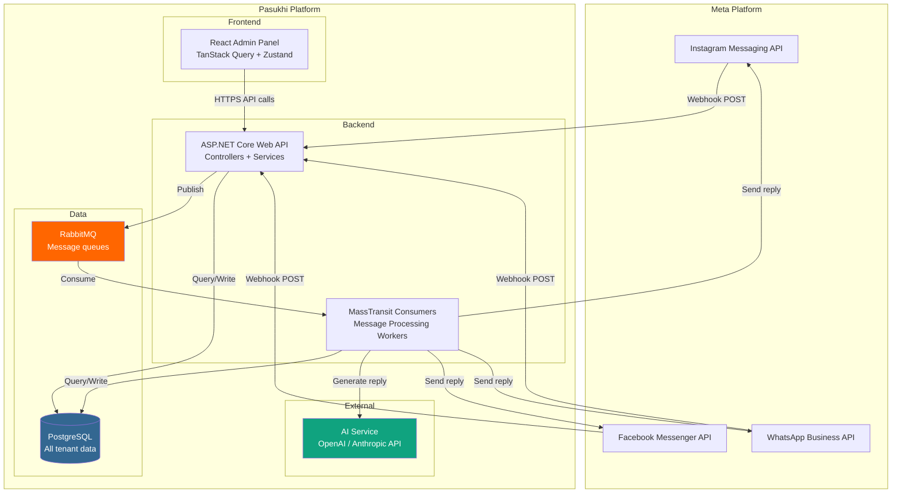
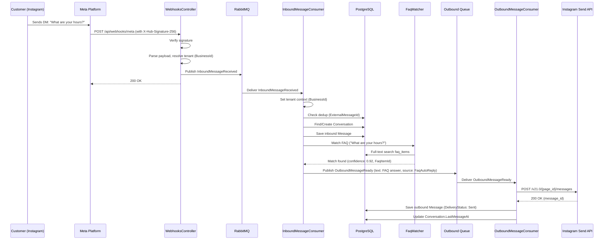
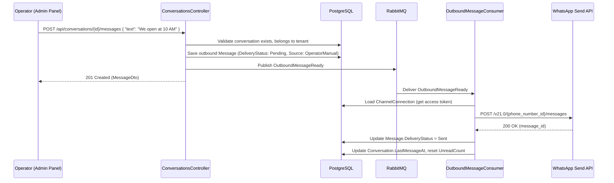

# Pasukhi (პასუხი) -- Architecture Blueprint

## Multi-Tenant AI Messaging Automation Platform

**Version:** 1.0 | **Date:** 2026-04-16 | **Status:** Architecture Draft

**GitHub Repo Description:** Multi-tenant B2B SaaS platform that automates customer replies across Instagram, Facebook Messenger, and WhatsApp using FAQ/rules-first processing with AI fallback. Built with ASP.NET Core, PostgreSQL, RabbitMQ, and React.

---

## 1. Executive Recommendation

### Architecture Style: Modular Monolith with Async Messaging

Build Pasukhi as a **modular monolith** with a single ASP.NET Core Web API backend, a React SPA admin panel, PostgreSQL for persistence, and RabbitMQ for async message processing. This is the same pattern proven in the existing Dressfield project, extended with multi-tenancy and queue-based message processing.

**Why modular monolith:**
- A solo developer cannot operate microservices. Period. One deployment unit, one database, one codebase.
- Clean Architecture layers (API, Application, Domain, Infrastructure) provide the same logical separation that microservices would, without the operational cost.
- If a module ever truly needs to be extracted (say the AI processing layer), the interface boundaries make that possible later. But that day is far away.
- RabbitMQ gives you async processing where it matters (inbound message handling, AI calls, outbound sending) without requiring a distributed system.

**What NOT to do:**
- Do NOT build microservices. You do not have the team, the ops infrastructure, or the traffic to justify it.
- Do NOT use Kafka. RabbitMQ is the right tool for task-queue workloads. Kafka is for event streaming at scale. You are not Netflix.
- Do NOT use Kubernetes. A single Azure App Service (or a Linux VPS with Docker Compose) is your deployment target.
- Do NOT use MediatR. Direct service injection is simpler, faster, and easier to debug. The Dressfield project already proves this works.
- Do NOT build a repository layer over every entity. EF Core's DbContext is already a Unit of Work + Repository. Only wrap it when you have a genuinely complex query that needs encapsulation.
- Do NOT build the business-owner-facing portal for MVP. The internal admin panel is your product until you validate demand.

**Overengineering risks:**
- Abstracting the AI layer too early (just use one provider directly first)
- Building a plugin system for channels (there are exactly three channels, all from Meta)
- Adding CQRS read/write separation (single PostgreSQL is enough)
- Building a custom workflow engine for automation rules (a simple priority-ordered rule evaluator is sufficient)

**What should stay simple in MVP:**
- One AI provider (OpenAI or Anthropic, not both)
- One deployment environment (production only; staging when you have paying customers)
- No real-time WebSocket push for the admin panel (polling every 5-10 seconds is fine for conversations)
- No multi-language support in the admin UI (English only for operators)
- No custom theming per business
- Analytics means "counts and timestamps in the database," not a data warehouse

---

## 2. High-Level System Architecture



### How the Three Meta Channels Fit In

All three channels (Instagram Messaging, Facebook Messenger, WhatsApp Business) are Meta Graph API products. They share:
- The same webhook verification protocol (hub.mode, hub.verify_token, hub.challenge)
- The same webhook payload structure (entry[].messaging[] or entry[].changes[])
- The same OAuth-based page/business token model
- The same rate limiting approach

The differences are in message payload details, send API endpoints, and media handling. This means a single webhook endpoint can receive all three, with channel-specific parsing adapters.

### Deployment Model

For MVP, this runs on:
- **Backend:** Single Azure App Service (B1/B2) or a Linux VPS with Docker Compose
- **Frontend:** Static build served from the same App Service, or a cheap static host (Vercel free tier, Netlify, or even the same server behind nginx)
- **PostgreSQL:** Azure Database for PostgreSQL Flexible Server (B1ms) or self-hosted on the same VPS
- **RabbitMQ:** CloudAMQP free tier (Little Lemur: 1M messages/month) or self-hosted via Docker
- **Domain:** pasukhi.ge or pasukhi.io

---

## 3. Product Operating Model

### How to Register a Business

1. A SuperAdmin (you) creates a new Business record via the admin panel.
2. The system generates a unique `BusinessId` (GUID) and a slug.
3. You create an Operator user account linked to that Business.
4. You provide the operator with login credentials.
5. The operator logs in and sees only their business's data.

There is no self-service registration for MVP. You onboard businesses manually because:
- You need to set up their Meta app connections (Facebook Page, Instagram account, WhatsApp number)
- You need to configure their initial FAQ items and automation rules
- You need to verify they are a legitimate business
- Self-service onboarding is a feature you build when you have 20+ businesses, not 2

### How a Business Is Represented

A Business is the top-level tenant entity. Everything in the system belongs to a Business:
- Channel connections (which Facebook Page, Instagram account, WhatsApp number)
- FAQ items (question-answer pairs for automated replies)
- Automation rules (pattern-matching rules with priority ordering)
- Conversations (grouped messages from a single customer on a single channel)
- Messages (individual inbound and outbound messages)
- AI prompts (system prompt template, business context, tone instructions)
- Settings (auto-reply enabled/disabled, escalation thresholds, working hours)
- Operator users (people who manage this business's messaging)

### How Messaging Channels Connect

1. The business owner or operator creates a Meta App (or you do it for them during onboarding).
2. They grant your Pasukhi Meta App the necessary permissions (pages_messaging, instagram_manage_messages, whatsapp_business_messaging).
3. You store their Page Access Token and WhatsApp Business Account ID as a ChannelConnection record.
4. You configure the webhook URL in their Meta App settings to point to `https://api.pasukhi.ge/api/webhooks/meta`.
5. The ChannelConnection record includes a `VerifyToken` (a random string) that Meta uses to verify the webhook.

Each ChannelConnection links a specific external account (Facebook Page ID, Instagram Account ID, or WhatsApp Phone Number ID) to a specific BusinessId.

### How Messages Arrive and Get Routed

1. A customer sends a DM on Instagram / Messenger / WhatsApp.
2. Meta sends an HTTP POST to your webhook endpoint.
3. The webhook controller verifies the request signature (X-Hub-Signature-256 header).
4. The controller parses the payload to extract the channel type and the external account ID (page ID, IG account ID, or phone number ID).
5. The system looks up the ChannelConnection by external account ID to resolve the BusinessId.
6. The raw webhook payload, along with the resolved BusinessId and channel type, is published to RabbitMQ.
7. A consumer picks up the message, normalizes it into the internal message model, finds or creates a Conversation, and enters the processing pipeline.

### How the System Decides: FAQ/Rules vs AI vs Escalation

The decision flow is strictly ordered:

1. **FAQ Match (deterministic, highest priority):** Check the incoming message text against the business's FAQ items using keyword matching and similarity scoring. If a match exceeds the confidence threshold (configurable, default 0.85), send the FAQ answer. Done.

2. **Automation Rule Match (deterministic, second priority):** Evaluate the business's automation rules in priority order. Rules can match on keywords, regex patterns, message type (e.g., image, story reply), or time of day. If a rule matches, execute its action (send canned response, tag conversation, assign to operator). Done.

3. **AI Fallback (probabilistic, third priority):** If no FAQ or rule matched, and AI is enabled for this business, send the message to the AI service with the business's system prompt, FAQ context, and conversation history. The AI generates a response. Before sending, run safety checks (does the response contain hallucinated information? does it contradict the FAQ? does it contain prohibited content?).

4. **Escalation (safety net):** If AI is disabled, if the AI confidence is below threshold, if safety checks fail, or if the customer explicitly requests a human, mark the conversation as escalated. Notify the operator. Do NOT send an automated reply.

### Why Internal Admin Tool First

- You need to see messages, manage FAQs, configure rules, and monitor escalations before any business owner can.
- The internal tool IS the product for the first 3-6 months. You are the operator.
- Building a customer-facing portal adds authentication complexity (business owner login vs admin login), branding/theming, billing, and self-service configuration. All of that is premature.
- The internal tool lets you iterate on the processing pipeline and AI prompts without customer-facing consequences.

### What Business Owner Sees vs What Operator Manages

**For MVP, the business owner sees nothing.** You (the operator) manage everything through the admin panel. The business owner communicates with you over email/phone about their FAQ items and rules.

**Post-MVP business owner portal (future):**
- Read-only dashboard: message volume, response times, escalation rate
- FAQ management: add/edit/delete FAQ items (with approval workflow)
- Working hours configuration
- Escalation notifications (email/SMS when a conversation is escalated)

**Operator (admin panel) manages:**
- All businesses (SuperAdmin) or their assigned business (Operator)
- Channel connections
- FAQ items and automation rules
- Conversation inbox with reply capability
- AI prompt configuration
- Escalation queue
- System settings

---

## 4. Multi-Tenant Architecture Strategy

### Tenant Isolation from Day One

Every row in every business-scoped table has a `BusinessId` column. There are no exceptions. This is a shared-database, shared-schema multi-tenancy model with row-level isolation.

**Why shared database:** You are not going to have 10,000 tenants. You might have 5-50 businesses in the first year. Separate databases per tenant would be operational overhead for zero benefit. A single PostgreSQL database with proper indexing and query filters handles this scale trivially.

### BusinessId Usage Across the System

```csharp
// Every tenant-scoped entity inherits from this
public abstract class TenantEntity
{
    public Guid Id { get; set; }
    public Guid BusinessId { get; set; }
    public Business Business { get; set; } = null!;
    public DateTime CreatedAt { get; set; } = DateTime.UtcNow;
    public DateTime UpdatedAt { get; set; } = DateTime.UtcNow;
}
```

The following entities are tenant-scoped (require BusinessId):
- ChannelConnection
- Conversation
- Message
- FaqItem
- AutomationRule
- Escalation
- BusinessPrompt
- BusinessSetting
- AuditLog (tenant-scoped entries)

The following entities are global (no BusinessId):
- Business (the tenant itself)
- AdminUser (linked to Business via BusinessId, but SuperAdmin users have no BusinessId restriction)
- System-level configuration

### Tenant Resolution from Webhooks

Webhooks from Meta do not include a BusinessId. Tenant resolution happens by looking up the external account ID:

```csharp
// In the webhook parsing step:
// 1. Extract page_id (Messenger), instagram_account_id (IG), or phone_number_id (WA)
// 2. Look up ChannelConnection by (ExternalAccountId, ChannelType)
// 3. The ChannelConnection record contains the BusinessId
// 4. All subsequent processing uses this BusinessId

public async Task<Guid?> ResolveTenantAsync(string externalAccountId, ChannelType channelType)
{
    var connection = await _db.ChannelConnections
        .Where(c => c.ExternalAccountId == externalAccountId
                  && c.ChannelType == channelType
                  && c.IsActive)
        .Select(c => (Guid?)c.BusinessId)
        .FirstOrDefaultAsync();

    return connection;
}
```

### Preventing Cross-Tenant Data Leaks

**EF Core Global Query Filters** are the primary defense:

```csharp
public class PasukhiDbContext : DbContext
{
    private readonly ITenantProvider _tenantProvider;

    protected override void OnModelCreating(ModelBuilder builder)
    {
        // Apply global filter to ALL tenant-scoped entities
        builder.Entity<Conversation>().HasQueryFilter(e => e.BusinessId == _tenantProvider.BusinessId);
        builder.Entity<Message>().HasQueryFilter(e => e.BusinessId == _tenantProvider.BusinessId);
        builder.Entity<FaqItem>().HasQueryFilter(e => e.BusinessId == _tenantProvider.BusinessId);
        builder.Entity<AutomationRule>().HasQueryFilter(e => e.BusinessId == _tenantProvider.BusinessId);
        builder.Entity<Escalation>().HasQueryFilter(e => e.BusinessId == _tenantProvider.BusinessId);
        builder.Entity<ChannelConnection>().HasQueryFilter(e => e.BusinessId == _tenantProvider.BusinessId);
        builder.Entity<BusinessPrompt>().HasQueryFilter(e => e.BusinessId == _tenantProvider.BusinessId);
        builder.Entity<BusinessSetting>().HasQueryFilter(e => e.BusinessId == _tenantProvider.BusinessId);
    }
}
```

**ITenantProvider** resolves the current BusinessId from:
- HTTP context (from JWT claims) for API requests
- Message context (from the queue message) for background consumers

```csharp
public interface ITenantProvider
{
    Guid BusinessId { get; }
}

// For HTTP requests:
public class HttpTenantProvider : ITenantProvider
{
    private readonly IHttpContextAccessor _httpContextAccessor;

    public Guid BusinessId =>
        Guid.Parse(_httpContextAccessor.HttpContext!.User.FindFirst("BusinessId")!.Value);
}

// For queue consumers:
public class QueueTenantProvider : ITenantProvider
{
    public Guid BusinessId { get; set; }
}
```

### Isolation of Prompts, FAQs, Rules, Message History

Each business has its own:
- **FAQ items:** Completely separate. Business A's FAQ about shipping has nothing to do with Business B's.
- **Automation rules:** Separate rule sets, separate priority ordering.
- **AI prompts:** Each business has its own system prompt, tone, personality, and context. When the AI processes a message, it only loads the current business's prompt and FAQ context.
- **Message history:** Conversations and messages are strictly scoped. The AI context window only includes messages from the current conversation (which belongs to one business).
- **Channel connections:** Each business connects its own Meta pages/accounts. The access tokens are stored per business.

### Common Mistakes That Break Tenant Safety

1. **Forgetting to set BusinessId on new records.** Mitigation: the `SaveChangesAsync` override validates that all TenantEntity instances have a non-empty BusinessId before saving.

2. **Using `.IgnoreQueryFilters()` carelessly.** Mitigation: only SuperAdmin endpoints and system-level background jobs should ever call `.IgnoreQueryFilters()`. Code review must catch this.

3. **Leaking BusinessId across queue messages.** Mitigation: every queue message contract includes BusinessId. Consumers set the QueueTenantProvider before processing.

4. **AI context contamination.** Mitigation: the AI prompt builder loads FAQ items and conversation history through the filtered DbContext, so it physically cannot see another business's data.

5. **Channel connection lookup without tenant scope.** The webhook tenant resolution query (by ExternalAccountId) is the one place where you intentionally query across tenants. This is correct because the webhook arrives before you know which tenant it belongs to. But all subsequent processing must use the resolved BusinessId.

6. **Admin users seeing other businesses' data.** Mitigation: Operator role users have a BusinessId in their JWT claims. SuperAdmin users have a special claim that allows them to switch between businesses.

---

## 5. High-Level Backend Architecture

### Layer Structure

Following the same Clean Architecture pattern from Dressfield, with modifications for multi-tenancy and messaging:

**Pasukhi.API** (Presentation Layer)
- Controllers (thin, delegate to services)
- Middleware (exception handling, request logging, tenant resolution)
- Filters (validation filter for FluentValidation)
- Program.cs (DI registration, pipeline configuration)
- References: Pasukhi.Application, Pasukhi.Infrastructure

**Pasukhi.Application** (Business Logic Layer)
- Services (business logic orchestration)
- DTOs (record-based request/response objects)
- Validators (FluentValidation rules)
- Interfaces (service contracts that Infrastructure implements)
- References: Pasukhi.Domain

**Pasukhi.Domain** (Core Domain Layer)
- Entities (EF Core entity classes)
- Enums (ChannelType, MessageDirection, ConversationStatus, EscalationReason, etc.)
- Value Objects (if needed)
- Domain Services (pure domain logic with no infrastructure dependencies)
- No external dependencies (only .NET base libraries)

**Pasukhi.Infrastructure** (Infrastructure Layer)
- Data/PasukhiDbContext.cs (EF Core, global query filters, audit field auto-set)
- Data/Configurations/ (EF Fluent API entity configurations)
- Data/Migrations/
- Services/ (implementations of Application interfaces)
- Channels/ (Meta API adapters for each channel)
- AI/ (AI provider integration)
- Messaging/ (MassTransit consumers and message contracts)
- References: Pasukhi.Domain, Pasukhi.Application

### EF Core + PostgreSQL Patterns

**Direct DbContext usage** (same as Dressfield):
```csharp
public class ConversationService : IConversationService
{
    private readonly PasukhiDbContext _db;

    public ConversationService(PasukhiDbContext db)
    {
        _db = db;
    }

    public async Task<ConversationDto?> GetByIdAsync(Guid id)
    {
        var conversation = await _db.Conversations
            .Include(c => c.Messages.OrderByDescending(m => m.CreatedAt).Take(50))
            .Include(c => c.ChannelConnection)
            .FirstOrDefaultAsync(c => c.Id == id);
        // Global query filter automatically applies BusinessId

        return conversation?.ToDto();
    }
}
```

**Audit field auto-setting:**
```csharp
public override async Task<int> SaveChangesAsync(CancellationToken cancellationToken = default)
{
    foreach (var entry in ChangeTracker.Entries<TenantEntity>())
    {
        switch (entry.State)
        {
            case EntityState.Added:
                entry.Entity.CreatedAt = DateTime.UtcNow;
                entry.Entity.UpdatedAt = DateTime.UtcNow;
                if (entry.Entity.BusinessId == Guid.Empty)
                    entry.Entity.BusinessId = _tenantProvider.BusinessId;
                break;
            case EntityState.Modified:
                entry.Entity.UpdatedAt = DateTime.UtcNow;
                break;
        }
    }

    return await base.SaveChangesAsync(cancellationToken);
}
```

### Repository Pattern Guidance

**Do NOT create repositories for:**
- Simple CRUD operations (use DbContext directly)
- Single-entity queries with basic filtering
- Any query that is used in only one place

**DO create a repository for:**
- Complex multi-entity queries that combine joins, aggregations, and business logic (e.g., conversation list with latest message, unread count, and escalation status)
- Queries that are reused across multiple services

For MVP, you will likely only need one repository: `IConversationRepository` for the complex inbox query. Everything else goes through DbContext directly.

### Unit of Work Assessment

EF Core's `DbContext` is already a Unit of Work. Calling `SaveChangesAsync()` commits all tracked changes in a single transaction. There is no need for an additional Unit of Work abstraction. For cases where you need explicit transaction control (e.g., creating a conversation AND its first message atomically), use `_db.Database.BeginTransactionAsync()`.

### Service Registration Pattern

Following Dressfield's pattern of interface-based DI with scoped lifetime:

```csharp
// In Program.cs
builder.Services.AddScoped<IConversationService, ConversationService>();
builder.Services.AddScoped<IFaqService, FaqService>();
builder.Services.AddScoped<IRuleService, RuleService>();
builder.Services.AddScoped<IChannelService, ChannelService>();
builder.Services.AddScoped<IEscalationService, EscalationService>();
builder.Services.AddScoped<IAiService, OpenAiService>();
builder.Services.AddScoped<ITenantProvider, HttpTenantProvider>();
builder.Services.AddScoped<IMessageProcessor, MessageProcessor>();
```

### RabbitMQ Integration via MassTransit

MassTransit is configured in Program.cs:

```csharp
builder.Services.AddMassTransit(x =>
{
    x.AddConsumer<InboundMessageConsumer>();
    x.AddConsumer<OutboundMessageConsumer>();
    x.AddConsumer<AiProcessingConsumer>();

    x.UsingRabbitMq((context, cfg) =>
    {
        cfg.Host(builder.Configuration["RabbitMQ:Host"], "/", h =>
        {
            h.Username(builder.Configuration["RabbitMQ:Username"]!);
            h.Password(builder.Configuration["RabbitMQ:Password"]!);
        });

        cfg.ConfigureEndpoints(context);
    });
});
```

### Environment-Specific Configuration

```json
// appsettings.json (defaults)
{
    "ConnectionStrings": {
        "DefaultConnection": ""
    },
    "Jwt": {
        "Secret": "",
        "Issuer": "https://api.pasukhi.ge",
        "Audience": "https://admin.pasukhi.ge",
        "AccessTokenExpirationMinutes": 15,
        "RefreshTokenExpirationDays": 7
    },
    "RabbitMQ": {
        "Host": "localhost",
        "Username": "guest",
        "Password": "guest"
    },
    "Meta": {
        "AppSecret": "",
        "GraphApiVersion": "v21.0"
    },
    "AI": {
        "Provider": "OpenAI",
        "ApiKey": "",
        "Model": "gpt-4o-mini",
        "MaxTokens": 500,
        "Temperature": 0.3
    }
}
```

```json
// appsettings.Development.json
{
    "ConnectionStrings": {
        "DefaultConnection": "Host=localhost;Database=pasukhi_dev;Username=postgres;Password=postgres"
    },
    "Jwt": {
        "Secret": "pasukhi-dev-secret-key-must-be-at-least-32-characters-long"
    },
    "Cors": {
        "Origins": ["http://localhost:5173"]
    }
}
```

---

## 6. Core Channel Architecture

### Unified Internal Message Model

The system normalizes all inbound messages from all three channels into a single internal model. Provider-specific details are stored as metadata, but the core processing pipeline works with the normalized model only.

```csharp
// Domain/Entities/Message.cs
public class Message : TenantEntity
{
    public Guid ConversationId { get; set; }
    public Conversation Conversation { get; set; } = null!;

    public MessageDirection Direction { get; set; } // Inbound, Outbound
    public MessageType MessageType { get; set; } // Text, Image, Video, Audio, File, Sticker, StoryReply, StoryMention, Reaction

    public string? TextContent { get; set; }
    public string? MediaUrl { get; set; }
    public string? MediaMimeType { get; set; }
    public string? ThumbnailUrl { get; set; }

    // Who sent/received
    public string ExternalSenderId { get; set; } = string.Empty; // Customer's platform-specific ID
    public string? SenderDisplayName { get; set; }

    // Processing metadata
    public MessageSource Source { get; set; } // Customer, FaqAutoReply, RuleAutoReply, AiAutoReply, OperatorManual
    public Guid? MatchedFaqItemId { get; set; }
    public Guid? MatchedRuleId { get; set; }
    public double? AiConfidenceScore { get; set; }

    // External IDs for deduplication
    public string ExternalMessageId { get; set; } = string.Empty; // Meta's message ID
    public string? ExternalTimestamp { get; set; }

    // Delivery status (for outbound)
    public DeliveryStatus DeliveryStatus { get; set; } // Pending, Sent, Delivered, Read, Failed

    // Raw payload for debugging
    public string? RawPayloadJson { get; set; }
}

// Domain/Entities/Conversation.cs
public class Conversation : TenantEntity
{
    public Guid ChannelConnectionId { get; set; }
    public ChannelConnection ChannelConnection { get; set; } = null!;

    public string ExternalCustomerId { get; set; } = string.Empty; // Platform-specific customer ID
    public string? CustomerDisplayName { get; set; }
    public string? CustomerProfilePictureUrl { get; set; }
    public ChannelType ChannelType { get; set; } // Instagram, Messenger, WhatsApp

    public ConversationStatus Status { get; set; } // Active, Escalated, Resolved, Archived
    public bool IsEscalated { get; set; }

    public DateTime? LastMessageAt { get; set; }
    public int UnreadCount { get; set; }

    public ICollection<Message> Messages { get; set; } = new List<Message>();
    public ICollection<Escalation> Escalations { get; set; } = new List<Escalation>();
}

// Domain/Enums/
public enum ChannelType { Instagram, Messenger, WhatsApp }
public enum MessageDirection { Inbound, Outbound }
public enum MessageType { Text, Image, Video, Audio, File, Sticker, StoryReply, StoryMention, Reaction, Location, Contact }
public enum MessageSource { Customer, FaqAutoReply, RuleAutoReply, AiAutoReply, OperatorManual }
public enum ConversationStatus { Active, Escalated, Resolved, Archived }
public enum DeliveryStatus { Pending, Sent, Delivered, Read, Failed }
```

### Provider Adapter Pattern

Each channel has an adapter that implements common interfaces. The core processing pipeline never knows which channel it is dealing with.

```csharp
// Application/Interfaces/IChannelProvider.cs
public interface IChannelProvider
{
    ChannelType ChannelType { get; }
    Task<SendResult> SendMessageAsync(ChannelConnection connection, OutboundMessage message);
    Task<SendResult> SendTextAsync(ChannelConnection connection, string recipientId, string text);
    Task<SendResult> SendMediaAsync(ChannelConnection connection, string recipientId, string mediaUrl, MessageType mediaType);
}

// Application/Interfaces/IWebhookVerifier.cs
public interface IWebhookVerifier
{
    bool VerifySignature(string payload, string signatureHeader, string appSecret);
    bool VerifySubscription(string mode, string verifyToken, string expectedToken);
}

// Application/Interfaces/IWebhookParser.cs
public interface IWebhookParser
{
    ChannelType ChannelType { get; }
    bool CanParse(string rawPayload);
    IEnumerable<ParsedInboundMessage> Parse(string rawPayload);
}

// Application/Interfaces/IMessageSender.cs
public interface IMessageSender
{
    Task<SendResult> SendAsync(Guid conversationId, string text, MessageSource source);
}

// Application/DTOs/ParsedInboundMessage.cs
public record ParsedInboundMessage(
    ChannelType ChannelType,
    string ExternalAccountId,   // The page/account/phone that received the message
    string ExternalSenderId,    // The customer's platform ID
    string ExternalMessageId,   // Meta's unique message ID
    string? SenderDisplayName,
    MessageType MessageType,
    string? TextContent,
    string? MediaUrl,
    string? MediaMimeType,
    string? RawTimestamp,
    string RawPayloadJson
);

public record SendResult(bool Success, string? ExternalMessageId, string? Error);
public record OutboundMessage(string RecipientId, string? Text, string? MediaUrl, MessageType MessageType);
```

### Channel Provider Implementations

```csharp
// Infrastructure/Channels/InstagramChannelProvider.cs
public class InstagramChannelProvider : IChannelProvider
{
    public ChannelType ChannelType => ChannelType.Instagram;

    public async Task<SendResult> SendTextAsync(ChannelConnection connection, string recipientId, string text)
    {
        // POST https://graph.facebook.com/v21.0/{page_id}/messages
        // { "recipient": { "id": recipientId }, "message": { "text": text } }
        // Authorization: Bearer {connection.AccessToken}
    }
}

// Infrastructure/Channels/MetaWebhookVerifier.cs (shared across all three channels)
public class MetaWebhookVerifier : IWebhookVerifier
{
    public bool VerifySignature(string payload, string signatureHeader, string appSecret)
    {
        // X-Hub-Signature-256: sha256=<hex>
        var expectedHash = ComputeHmacSha256(payload, appSecret);
        return $"sha256={expectedHash}" == signatureHeader;
    }

    public bool VerifySubscription(string mode, string verifyToken, string expectedToken)
    {
        return mode == "subscribe" && verifyToken == expectedToken;
    }
}
```

### Keeping Provider Details Out of Core Logic

The `IChannelProvider` interface is defined in the Application layer. Implementations live in Infrastructure. The message processing pipeline in Application only works with `ParsedInboundMessage` and `IMessageSender`. It never references Instagram, Messenger, or WhatsApp-specific classes.

A `ChannelProviderFactory` resolves the correct provider by ChannelType:

```csharp
public class ChannelProviderFactory
{
    private readonly IEnumerable<IChannelProvider> _providers;

    public ChannelProviderFactory(IEnumerable<IChannelProvider> providers)
    {
        _providers = providers;
    }

    public IChannelProvider GetProvider(ChannelType channelType)
    {
        return _providers.FirstOrDefault(p => p.ChannelType == channelType)
            ?? throw new InvalidOperationException($"No provider registered for {channelType}");
    }
}
```

---

## 7. Message Processing Pipeline

This is the most critical section. The pipeline is the core product.

### Complete Step-by-Step Flow

**Step 1: Webhook Receive**
- Meta sends HTTP POST to `POST /api/webhooks/meta`
- Controller reads the raw request body as a string

**Step 2: Signature Verification**
- Extract `X-Hub-Signature-256` header
- Compute HMAC-SHA256 of raw body using Meta App Secret
- Compare. If mismatch, return 403 and log a warning. Do NOT process.

**Step 3: Subscription Verification (GET requests only)**
- Meta sends GET with `hub.mode=subscribe`, `hub.verify_token`, `hub.challenge`
- Compare `hub.verify_token` against stored token
- Return `hub.challenge` as plain text with 200 OK

**Step 4: Quick Acknowledge**
- Return 200 OK to Meta immediately (within 5 seconds, Meta's requirement)
- Do NOT process the message synchronously in the webhook handler
- This is why RabbitMQ exists

**Step 5: Parse and Identify Channel**
- Parse the JSON payload to identify channel type (the `object` field: "instagram", "page", "whatsapp_business_account")
- Extract the external account ID (page ID, IG account ID, or phone number ID)
- Use the appropriate `IWebhookParser` to extract `ParsedInboundMessage` objects (one webhook can contain multiple messages)

**Step 6: Tenant Resolution**
- Look up `ChannelConnection` by `(ExternalAccountId, ChannelType)` where `IsActive = true`
- If not found, log a warning and discard. This means someone sent a message to an account that is not connected.
- The `ChannelConnection.BusinessId` is the tenant.

**Step 7: Publish to Queue**
- For each `ParsedInboundMessage`, publish an `InboundMessageReceived` message to RabbitMQ
- The queue message includes: BusinessId, ChannelConnectionId, ParsedInboundMessage, ReceivedAtUtc

```csharp
// The webhook controller (synchronous, fast):
[HttpPost("meta")]
[AllowAnonymous]
public async Task<IActionResult> MetaWebhook()
{
    var rawBody = await new StreamReader(Request.Body).ReadToEndAsync();
    var signature = Request.Headers["X-Hub-Signature-256"].FirstOrDefault();

    if (!_webhookVerifier.VerifySignature(rawBody, signature!, _metaConfig.AppSecret))
        return StatusCode(403);

    var messages = _webhookParser.ParseAll(rawBody);

    foreach (var parsed in messages)
    {
        var connection = await _channelLookup.FindConnectionAsync(parsed.ExternalAccountId, parsed.ChannelType);
        if (connection == null)
        {
            _logger.LogWarning("No channel connection for {AccountId} ({Channel})",
                parsed.ExternalAccountId, parsed.ChannelType);
            continue;
        }

        await _publishEndpoint.Publish(new InboundMessageReceived
        {
            BusinessId = connection.BusinessId,
            ChannelConnectionId = connection.Id,
            ChannelType = parsed.ChannelType,
            ExternalAccountId = parsed.ExternalAccountId,
            ExternalSenderId = parsed.ExternalSenderId,
            ExternalMessageId = parsed.ExternalMessageId,
            SenderDisplayName = parsed.SenderDisplayName,
            MessageType = parsed.MessageType,
            TextContent = parsed.TextContent,
            MediaUrl = parsed.MediaUrl,
            MediaMimeType = parsed.MediaMimeType,
            RawTimestamp = parsed.RawTimestamp,
            RawPayloadJson = parsed.RawPayloadJson,
            ReceivedAtUtc = DateTime.UtcNow
        });
    }

    return Ok();
}
```

**Step 8: Consumer Picks Up Message (InboundMessageConsumer)**
- MassTransit consumer receives the `InboundMessageReceived` message
- Sets the `QueueTenantProvider.BusinessId` from the message
- This ensures all subsequent DbContext queries are tenant-scoped

**Step 9: Deduplication Check**
- Check if a Message with this `ExternalMessageId` already exists
- If yes, skip processing (Meta can send duplicate webhooks)

**Step 10: Conversation Lookup/Creation**
- Look for an existing active Conversation with this `ExternalCustomerId` on this `ChannelConnectionId`
- If found and not too old (within configurable window, e.g., 24 hours since last message), reuse it
- If not found or expired, create a new Conversation

**Step 11: Persist Inbound Message**
- Create a new Message record with Direction = Inbound, Source = Customer
- Update the Conversation's `LastMessageAt` and increment `UnreadCount`
- Save to database

**Step 12: FAQ/Rule Match**
- Only for text messages (skip media-only messages)
- Call `IFaqMatcher.FindMatchAsync(businessId, textContent)` which returns the best-matching FAQ item and confidence score
- If confidence >= threshold, go to Step 14 (send FAQ reply)
- If no FAQ match, call `IRuleMatcher.FindMatchAsync(businessId, textContent, messageContext)` which evaluates rules in priority order
- If a rule matches, execute its action and go to Step 14 (if the action is sending a reply)

**Step 13: AI Fallback**
- If no FAQ or rule matched, and the business has AI enabled:
  - Load the business's AI prompt (system prompt + FAQ context + conversation history)
  - Call `IAiService.GenerateReplyAsync(prompt, conversationHistory)`
  - Receive the AI response with a confidence score
  - If confidence is below threshold, go to Step 15 (escalate)
  - Run safety checks: does the response look reasonable? Is it not too long? Does it not contain phone numbers, addresses, or pricing not in the FAQ?
  - If safety checks fail, go to Step 15 (escalate)

**Step 14: Send Reply (Outbound)**
- Publish `OutboundMessageReady` to RabbitMQ with the reply text, source (FAQ/Rule/AI), and metadata
- The `OutboundMessageConsumer` picks it up:
  - Resolve the `IChannelProvider` for the conversation's channel type
  - Call `SendTextAsync` or `SendMediaAsync` with the connection's access token
  - Persist the outbound Message record with DeliveryStatus
  - Update conversation's `LastMessageAt`

**Step 15: Escalation**
- Create an Escalation record with the reason (NoMatch, LowAiConfidence, SafetyCheckFailed, CustomerRequested)
- Update the Conversation.Status to Escalated
- Set Conversation.IsEscalated = true
- Log the escalation for monitoring
- (Future: send notification to operator via email/push)

**Step 16: Persistence Verification**
- All database writes happen within the consumer's scope
- If the consumer fails (throws exception), MassTransit retries per the retry policy
- If all retries fail, the message goes to the dead letter queue

**Step 17: Logging**
- Every step logs structured data via Serilog
- BusinessId, ConversationId, ExternalMessageId, and ChannelType are included in every log entry
- Processing duration is logged for performance monitoring

**Step 18: Analytics Hooks**
- After successful processing, update counters:
  - Total messages received (per business, per channel, per day)
  - Auto-reply rate (FAQ hit, rule hit, AI hit, escalation)
  - Average response time
  - These are simple UPDATE statements on denormalized counter tables, not complex analytics

---

## 8. RabbitMQ Architecture

### Why RabbitMQ Is Useful Here

1. **Meta requires fast webhook responses.** You must return 200 within 5 seconds. Processing a message (FAQ matching, AI call, outbound send) takes 1-10 seconds. Without a queue, you would need to process synchronously in the webhook handler, which violates Meta's contract.

2. **AI calls are slow and unreliable.** OpenAI API calls take 1-5 seconds and can timeout. You do not want these blocking your webhook endpoint.

3. **Outbound sending can fail.** Meta's send API has rate limits and transient errors. A queue with retry gives you automatic resilience.

4. **Decoupling.** The webhook handler's only job is: verify, parse, resolve tenant, enqueue. The processing logic is completely separate.

### Which Parts Should Be Async

| Operation | Sync or Async | Why |
|-----------|--------------|-----|
| Webhook receive + verify | Sync (HTTP) | Must return 200 quickly |
| Inbound message parsing + tenant resolution | Sync (HTTP) | Simple and fast, needed before enqueue |
| Conversation lookup/creation | Async (queue) | Database operation, can retry |
| FAQ/rule matching | Async (queue) | Part of processing pipeline |
| AI generation | Async (queue) | Slow, unreliable, needs retry |
| Outbound message sending | Async (queue) | Can fail, needs retry, rate limited |
| Admin API requests | Sync (HTTP) | Standard request-response |
| Manual operator reply | Sync API + Async send | API returns immediately, send is queued |

### Suggested Queues

MassTransit uses convention-based naming. The queues are:

1. **`inbound-message-received`** -- Receives parsed inbound messages from the webhook handler
   - Producer: WebhookController
   - Consumer: InboundMessageConsumer (does conversation lookup, FAQ matching, AI, escalation decision)
   - Concurrency: 5-10 concurrent consumers

2. **`outbound-message-ready`** -- Receives messages that need to be sent via the channel provider
   - Producer: InboundMessageConsumer (for auto-replies), ManualReplyService (for operator replies)
   - Consumer: OutboundMessageConsumer (calls channel provider, persists result)
   - Concurrency: 3-5 concurrent consumers (respect Meta rate limits)

3. **`ai-processing-requested`** -- Receives messages that need AI processing (optional, can be inline in InboundMessageConsumer for MVP)
   - Producer: InboundMessageConsumer (when FAQ/rule didn't match and AI is enabled)
   - Consumer: AiProcessingConsumer (calls AI service, publishes OutboundMessageReady or creates escalation)
   - Concurrency: 3-5 concurrent consumers

For MVP, you can simplify to just two queues (inbound and outbound) and do AI processing inline in the inbound consumer. Split it out only if AI call latency becomes a bottleneck.

### Retry Strategy

```csharp
cfg.ReceiveEndpoint("inbound-message-received", e =>
{
    e.UseMessageRetry(r => r.Intervals(
        TimeSpan.FromSeconds(1),
        TimeSpan.FromSeconds(5),
        TimeSpan.FromSeconds(15),
        TimeSpan.FromSeconds(60)
    ));

    e.ConfigureConsumer<InboundMessageConsumer>(context);
});
```

- 4 retries with increasing intervals: 1s, 5s, 15s, 60s
- After all retries fail, message goes to the dead-letter queue (MassTransit creates `*_error` queues automatically)
- Monitor the error queues. If messages accumulate, something is broken.

### Dead Letter Handling

MassTransit automatically creates `*_error` and `*_skipped` queues. Messages that fail all retries land in `*_error`. For MVP, you inspect these manually. Later, you can add a consumer on the error queue that logs to a monitoring system or sends an alert.

### Idempotency Considerations

Messages can be delivered more than once (RabbitMQ at-least-once semantics). Handle this:

1. **Inbound messages:** Check `ExternalMessageId` before processing. If already exists in database, skip.
2. **Outbound messages:** Use the `MessageId` (internal GUID) as an idempotency key. Check if the message already has `DeliveryStatus != Pending` before sending.

### Queue Message Contracts

All queue messages include `BusinessId` for tenant resolution:

```csharp
// Infrastructure/Messaging/Contracts/InboundMessageReceived.cs
public record InboundMessageReceived
{
    public Guid BusinessId { get; init; }
    public Guid ChannelConnectionId { get; init; }
    public ChannelType ChannelType { get; init; }
    public string ExternalAccountId { get; init; } = string.Empty;
    public string ExternalSenderId { get; init; } = string.Empty;
    public string ExternalMessageId { get; init; } = string.Empty;
    public string? SenderDisplayName { get; init; }
    public MessageType MessageType { get; init; }
    public string? TextContent { get; init; }
    public string? MediaUrl { get; init; }
    public string? MediaMimeType { get; init; }
    public string? RawTimestamp { get; init; }
    public string RawPayloadJson { get; init; } = string.Empty;
    public DateTime ReceivedAtUtc { get; init; }
}

// Infrastructure/Messaging/Contracts/OutboundMessageReady.cs
public record OutboundMessageReady
{
    public Guid BusinessId { get; init; }
    public Guid ConversationId { get; init; }
    public Guid ChannelConnectionId { get; init; }
    public ChannelType ChannelType { get; init; }
    public string RecipientExternalId { get; init; } = string.Empty;
    public string Text { get; init; } = string.Empty;
    public MessageSource Source { get; init; }
    public Guid? MatchedFaqItemId { get; init; }
    public Guid? MatchedRuleId { get; init; }
    public double? AiConfidenceScore { get; init; }
}
```

**Sample Queue Message (JSON):**

```json
{
  "businessId": "a1b2c3d4-e5f6-7890-abcd-ef1234567890",
  "channelConnectionId": "b2c3d4e5-f6a7-8901-bcde-f12345678901",
  "channelType": "Instagram",
  "externalAccountId": "17841400123456789",
  "externalSenderId": "17841400987654321",
  "externalMessageId": "aWdfZANOIzE3ODQxNDQ...",
  "senderDisplayName": "giorgi_example",
  "messageType": "Text",
  "textContent": "Hello, what are your working hours?",
  "mediaUrl": null,
  "mediaMimeType": null,
  "rawTimestamp": "1713272400",
  "rawPayloadJson": "{...}",
  "receivedAtUtc": "2026-04-16T12:00:00Z"
}
```

---

## 9. AI Architecture

### AI Service Abstraction

```csharp
// Application/Interfaces/IAiService.cs
public interface IAiService
{
    Task<AiReplyResult> GenerateReplyAsync(AiContext context);
}

public record AiContext(
    Guid BusinessId,
    string SystemPrompt,
    List<FaqItemDto> RelevantFaqs,
    List<ConversationMessageDto> ConversationHistory,
    string InboundMessageText,
    string CustomerDisplayName,
    ChannelType ChannelType
);

public record AiReplyResult(
    bool Success,
    string? ReplyText,
    double ConfidenceScore,     // 0.0 to 1.0
    bool ShouldEscalate,
    string? EscalationReason,
    int TokensUsed,
    TimeSpan ProcessingTime
);
```

### Prompt Structure

The prompt is assembled from multiple pieces:

```
[System Prompt - from BusinessPrompt table]
You are a customer service assistant for {business.Name}. {business.Description}
Your tone is {business.ToneDescription}.
You ONLY answer questions using the information provided below.
If you do not know the answer, say so and offer to connect the customer with a human representative.
NEVER make up information. NEVER provide prices, phone numbers, or addresses that are not in the FAQ below.

[FAQ Context - from FaqItem table, filtered by relevance]
FAQ:
Q: What are your working hours?
A: We are open Monday to Friday, 10:00 AM to 7:00 PM.

Q: Do you offer delivery?
A: Yes, we deliver within Tbilisi for 5 GEL. Delivery to regions costs 10 GEL.

Q: How can I return a product?
A: You can return any product within 14 days of purchase with the receipt.

[Conversation History - last N messages from this conversation]
Previous messages:
Customer: Hi there
Assistant: Hello! How can I help you today?
Customer: {current message}

[Instructions]
Respond to the customer's latest message. Keep your response concise (under 200 words).
If the customer's question is not covered by the FAQ, respond with: "I want to make sure I give you the right information. Let me connect you with our team who can help with this."
Respond in the same language the customer is using.
```

### Business Context Loading

When the AI consumer processes a message:

1. Load `BusinessPrompt` for this business (system prompt, tone, constraints)
2. Load all `FaqItem` records for this business (filtered: only active items)
3. Optionally, use keyword overlap to select the most relevant 10-15 FAQ items instead of sending all of them (reduces token cost)
4. Load the last 10 messages from this conversation (for context)
5. Assemble the full prompt and send to the AI API

### FAQ-First / AI-Second Design

This is the single most important architectural decision for this product. The processing order is:

1. Exact keyword match against FAQ question field
2. Fuzzy keyword match (using normalized text, removing stop words)
3. If PostgreSQL full-text search gives a high-confidence match (> 0.85), use the FAQ answer directly
4. If match is moderate (0.6-0.85), include the FAQ item as "likely relevant" context for the AI
5. If no match (< 0.6), send to AI with full FAQ context

This design means:
- 60-80% of messages are answered by FAQ items with zero AI cost
- AI is only invoked for genuinely novel questions
- FAQ answers are 100% predictable and operator-controlled
- The business owner trusts the system because they wrote the answers

### Token/Cost Control

- Use `gpt-4o-mini` (not `gpt-4o` or `gpt-4`) for cost efficiency. At roughly $0.15/1M input tokens and $0.60/1M output tokens, processing 1000 messages costs approximately $0.50-1.00.
- Set `max_tokens: 500` on every API call (prevents runaway responses)
- Set `temperature: 0.3` (low creativity, high consistency)
- Track token usage per business in the database (for future billing)
- Set a daily token budget per business (e.g., 50,000 tokens/day). If exceeded, escalate instead of calling AI.
- Log every AI call with token count, latency, and result

### Safety Constraints and Escalation Behavior

Before sending an AI-generated reply:

1. **Length check:** Response must be between 1 and 1000 characters
2. **Language check:** Response should be in the same language as the customer's message (basic heuristic)
3. **Prohibited content check:** Response must not contain phone numbers, email addresses, or URLs that are not in the business's FAQ or settings
4. **Contradiction check:** If the response directly contradicts a FAQ answer, escalate
5. **Confidence check:** If the AI's output seems uncertain (contains phrases like "I think", "I'm not sure", "I might be wrong"), escalate

If any safety check fails, the system:
- Does NOT send the AI response
- Creates an Escalation record with the failed check as the reason
- Marks the conversation as escalated
- Stores the AI's rejected response for operator review (so they can improve the prompt)

### Preventing Hallucinated Business Answers

The primary defense is the system prompt instruction: "You ONLY answer questions using the information provided below." Combined with:
- Providing the FAQ context in full, so the AI has the correct information available
- Keeping temperature low (0.3) to reduce creative fabrication
- The safety checks above (especially the prohibited content check)
- Making it easy for the AI to say "I don't know" by explicitly instructing it to do so

### AI Layer Ownership Boundaries

The AI service is a leaf dependency. It:
- Receives a fully assembled prompt (assembled by the Application layer)
- Returns a result (text + confidence + metadata)
- Has no knowledge of conversations, tenants, or channels
- Can be swapped from OpenAI to Anthropic to a local model by implementing a different `IAiService`

The Application layer owns:
- Prompt assembly (loading business context, FAQ, conversation history)
- Deciding whether to call AI (FAQ-first, rule-second)
- Safety checks on AI output
- Escalation decision

---

## 10. Frontend Admin Architecture

### React + TypeScript Folder Structure

This is a Vite + React SPA (NOT Next.js). The admin panel has no SEO requirements. It is a pure client-side application.

```
pasukhi-admin/
├── public/
│   └── favicon.ico
├── src/
│   ├── main.tsx                          # Entry point
│   ├── App.tsx                           # Router + providers
│   ├── api/
│   │   ├── client.ts                     # Axios instance with interceptors
│   │   ├── auth.ts                       # login, logout, refresh
│   │   ├── businesses.ts                 # CRUD
│   │   ├── channels.ts                   # channel connection CRUD
│   │   ├── conversations.ts              # list, getById, reply
│   │   ├── faqs.ts                       # CRUD
│   │   ├── rules.ts                      # CRUD
│   │   ├── escalations.ts               # list, resolve
│   │   ├── analytics.ts                  # dashboard stats
│   │   └── settings.ts                   # business settings, AI prompts
│   ├── components/
│   │   ├── ui/                           # shadcn/ui primitives (Button, Input, Card, Table, Dialog, etc.)
│   │   ├── layout/
│   │   │   ├── app-layout.tsx            # Sidebar + header + main content area
│   │   │   ├── sidebar.tsx               # Navigation sidebar
│   │   │   └── header.tsx                # Top bar with user menu + business selector
│   │   ├── conversations/
│   │   │   ├── conversation-list.tsx     # List of conversations with search/filter
│   │   │   ├── conversation-detail.tsx   # Message thread view
│   │   │   ├── message-bubble.tsx        # Single message (inbound/outbound styled differently)
│   │   │   ├── reply-composer.tsx        # Text input for manual replies
│   │   │   └── conversation-filters.tsx  # Filter by channel, status, escalated
│   │   ├── faqs/
│   │   │   ├── faq-list.tsx
│   │   │   ├── faq-form.tsx
│   │   │   └── faq-import.tsx            # Bulk import from CSV
│   │   ├── rules/
│   │   │   ├── rule-list.tsx
│   │   │   ├── rule-form.tsx
│   │   │   └── rule-priority-editor.tsx  # Drag-and-drop reorder
│   │   ├── escalations/
│   │   │   ├── escalation-queue.tsx
│   │   │   └── escalation-detail.tsx
│   │   ├── channels/
│   │   │   ├── channel-list.tsx
│   │   │   └── channel-connection-form.tsx
│   │   ├── analytics/
│   │   │   ├── dashboard-stats.tsx       # Key metrics cards
│   │   │   └── message-chart.tsx         # Simple bar chart (message volume over time)
│   │   └── shared/
│   │       ├── data-table.tsx            # Reusable table with sorting/pagination
│   │       ├── confirm-dialog.tsx
│   │       ├── loading-spinner.tsx
│   │       ├── error-boundary.tsx
│   │       └── empty-state.tsx
│   ├── features/
│   │   ├── auth/
│   │   │   ├── login-page.tsx
│   │   │   └── use-auth.ts
│   │   ├── dashboard/
│   │   │   └── dashboard-page.tsx
│   │   ├── conversations/
│   │   │   └── conversations-page.tsx    # Combines list + detail in split view
│   │   ├── faqs/
│   │   │   ├── faqs-page.tsx
│   │   │   └── faq-edit-page.tsx
│   │   ├── rules/
│   │   │   ├── rules-page.tsx
│   │   │   └── rule-edit-page.tsx
│   │   ├── escalations/
│   │   │   └── escalations-page.tsx
│   │   ├── channels/
│   │   │   └── channels-page.tsx
│   │   ├── settings/
│   │   │   ├── business-settings-page.tsx
│   │   │   └── ai-prompt-page.tsx
│   │   └── businesses/
│   │       ├── businesses-page.tsx       # SuperAdmin only
│   │       └── business-form-page.tsx
│   ├── hooks/
│   │   ├── use-conversations.ts          # TanStack Query hooks
│   │   ├── use-faqs.ts
│   │   ├── use-rules.ts
│   │   ├── use-escalations.ts
│   │   └── use-analytics.ts
│   ├── stores/
│   │   ├── auth-store.ts                 # Zustand: user, accessToken
│   │   └── ui-store.ts                   # Zustand: sidebar collapsed, active business
│   ├── types/
│   │   ├── auth.ts
│   │   ├── business.ts
│   │   ├── channel.ts
│   │   ├── conversation.ts
│   │   ├── message.ts
│   │   ├── faq.ts
│   │   ├── rule.ts
│   │   ├── escalation.ts
│   │   └── analytics.ts
│   ├── lib/
│   │   ├── utils.ts                      # cn(), formatDate(), etc.
│   │   └── constants.ts                  # API URL, polling intervals
│   └── schemas/
│       ├── auth-schemas.ts               # Zod schemas for forms
│       ├── faq-schemas.ts
│       ├── rule-schemas.ts
│       └── channel-schemas.ts
├── index.html
├── vite.config.ts
├── tsconfig.json
├── tailwind.config.ts
├── components.json                       # shadcn/ui config
└── package.json
```

### State Management

**TanStack Query** for all server state:
```typescript
// hooks/use-conversations.ts
export function useConversations(filters: ConversationFilters) {
  return useQuery({
    queryKey: ['conversations', filters],
    queryFn: () => conversationsApi.list(filters),
    refetchInterval: 5000, // Poll every 5 seconds for new messages
  });
}

export function useConversation(id: string) {
  return useQuery({
    queryKey: ['conversations', id],
    queryFn: () => conversationsApi.getById(id),
    refetchInterval: 3000, // Poll more frequently for active conversation
  });
}

export function useSendReply() {
  const queryClient = useQueryClient();
  return useMutation({
    mutationFn: (data: { conversationId: string; text: string }) =>
      conversationsApi.sendReply(data.conversationId, data.text),
    onSuccess: (_, variables) => {
      queryClient.invalidateQueries({ queryKey: ['conversations', variables.conversationId] });
    },
  });
}
```

**Zustand** for client-only state:
```typescript
// stores/auth-store.ts
interface AuthState {
  user: User | null;
  accessToken: string | null;
  setAuth: (user: User, token: string) => void;
  clearAuth: () => void;
}

export const useAuthStore = create<AuthState>()((set) => ({
  user: null,
  accessToken: null,
  setAuth: (user, accessToken) => set({ user, accessToken }),
  clearAuth: () => set({ user: null, accessToken: null }),
}));
```

### API Layer Organization

Following the Dressfield pattern with Axios:

```typescript
// api/client.ts
const api = axios.create({
  baseURL: import.meta.env.VITE_API_URL || 'http://localhost:5000',
  withCredentials: true,
  headers: { 'Content-Type': 'application/json' },
});

// Request interceptor: attach access token
api.interceptors.request.use((config) => {
  const token = useAuthStore.getState().accessToken;
  if (token) config.headers.Authorization = `Bearer ${token}`;
  return config;
});

// Response interceptor: refresh token on 401
api.interceptors.response.use(
  (response) => response,
  async (error) => {
    const originalRequest = error.config;
    if (error.response?.status === 401 && !originalRequest._retry) {
      originalRequest._retry = true;
      try {
        const { data } = await axios.post(`${api.defaults.baseURL}/api/auth/refresh`, {}, { withCredentials: true });
        useAuthStore.getState().setAuth(data.user, data.accessToken);
        originalRequest.headers.Authorization = `Bearer ${data.accessToken}`;
        return api(originalRequest);
      } catch {
        useAuthStore.getState().clearAuth();
        window.location.href = '/login';
        return Promise.reject(error);
      }
    }
    return Promise.reject(error);
  }
);
```

### Routing Structure

```typescript
// App.tsx
<Routes>
  <Route path="/login" element={<LoginPage />} />

  <Route element={<AuthGuard />}>
    <Route element={<AppLayout />}>
      <Route path="/" element={<DashboardPage />} />
      <Route path="/conversations" element={<ConversationsPage />} />
      <Route path="/conversations/:id" element={<ConversationsPage />} />
      <Route path="/escalations" element={<EscalationsPage />} />
      <Route path="/faqs" element={<FaqsPage />} />
      <Route path="/faqs/:id" element={<FaqEditPage />} />
      <Route path="/rules" element={<RulesPage />} />
      <Route path="/rules/:id" element={<RuleEditPage />} />
      <Route path="/channels" element={<ChannelsPage />} />
      <Route path="/settings" element={<BusinessSettingsPage />} />
      <Route path="/settings/ai" element={<AiPromptPage />} />

      {/* SuperAdmin only */}
      <Route element={<SuperAdminGuard />}>
        <Route path="/businesses" element={<BusinessesPage />} />
        <Route path="/businesses/new" element={<BusinessFormPage />} />
        <Route path="/businesses/:id" element={<BusinessFormPage />} />
      </Route>
    </Route>
  </Route>
</Routes>
```

### Form Handling

Following the Dressfield pattern (React Hook Form + Zod):

```typescript
// schemas/faq-schemas.ts
export const faqSchema = z.object({
  question: z.string().min(3, 'Question must be at least 3 characters').max(500),
  answer: z.string().min(1, 'Answer is required').max(2000),
  keywords: z.string().max(500).optional(), // comma-separated keywords
  isActive: z.boolean().default(true),
});
export type FaqFormData = z.infer<typeof faqSchema>;
```

### MVP Screens vs Later Screens

**MVP screens:**
- Login
- Dashboard (message count, escalation count, auto-reply rate)
- Conversations (split view: list + detail with reply)
- Escalation queue
- FAQ management (CRUD)
- Automation rules (CRUD)
- Channel connections (list + create)
- Business settings (working hours, auto-reply toggle)
- AI prompt editor

**Later screens (post-MVP):**
- Business management (SuperAdmin multi-tenant management)
- Analytics dashboard with charts
- Audit log viewer
- Bulk FAQ import/export
- Conversation search and advanced filters
- Notification settings
- Billing and usage

---

## 11. Core Business Modules

### Auth Module

**Responsibility:** Admin user authentication and session management.

**Key entities:**
- `AdminUser` (extends ASP.NET Identity, has `BusinessId?` for Operators, null for SuperAdmins)
- `RefreshToken` (same pattern as Dressfield)

**Key API endpoints:**
- `POST /api/auth/login` -- Login with email/password, returns JWT + sets refresh cookie
- `POST /api/auth/refresh` -- Refresh access token using httpOnly cookie
- `POST /api/auth/logout` -- Revoke refresh tokens
- `GET /api/auth/me` -- Get current user info

**Dependencies:** None (foundational module)

### Businesses Module

**Responsibility:** Multi-tenant business management. Creating, updating, and configuring businesses.

**Key entities:**
- `Business` (Id, Name, Slug, Description, LogoUrl, IsActive, CreatedAt, UpdatedAt)

**Key API endpoints:**
- `GET /api/businesses` -- List all businesses (SuperAdmin)
- `GET /api/businesses/{id}` -- Get business details
- `POST /api/businesses` -- Create business (SuperAdmin)
- `PUT /api/businesses/{id}` -- Update business (SuperAdmin)

**Dependencies:** Auth (SuperAdmin authorization)

### Channels Module

**Responsibility:** Managing channel connections (Facebook Page, Instagram, WhatsApp). Storing access tokens and webhook configuration.

**Key entities:**
- `ChannelConnection` (Id, BusinessId, ChannelType, ExternalAccountId, ExternalAccountName, AccessToken, VerifyToken, IsActive, LastWebhookAt)

**Key API endpoints:**
- `GET /api/channels` -- List channel connections for current business
- `POST /api/channels` -- Create channel connection
- `PUT /api/channels/{id}` -- Update (rotate token, toggle active)
- `DELETE /api/channels/{id}` -- Soft delete / deactivate
- `POST /api/channels/{id}/test` -- Send test message to verify connection

**Dependencies:** Businesses (tenant-scoped)

### FAQs Module

**Responsibility:** Managing FAQ items for automated replies. Each item has a question, answer, and optional keywords.

**Key entities:**
- `FaqItem` (Id, BusinessId, Question, Answer, Keywords, MatchCount, IsActive, SortOrder, CreatedAt, UpdatedAt)

**Key API endpoints:**
- `GET /api/faqs` -- List FAQ items for current business
- `GET /api/faqs/{id}` -- Get single FAQ item
- `POST /api/faqs` -- Create FAQ item
- `PUT /api/faqs/{id}` -- Update FAQ item
- `DELETE /api/faqs/{id}` -- Delete FAQ item
- `POST /api/faqs/import` -- Bulk import from CSV

**Dependencies:** Businesses (tenant-scoped)

### Rules Module

**Responsibility:** Managing automation rules. Rules are evaluated in priority order and can match on keywords, regex, or message type.

**Key entities:**
- `AutomationRule` (Id, BusinessId, Name, Priority, TriggerType [Keyword/Regex/MessageType/TimeOfDay], TriggerValue, ActionType [SendReply/TagConversation/Escalate], ActionValue, IsActive, MatchCount, CreatedAt, UpdatedAt)

**Key API endpoints:**
- `GET /api/rules` -- List rules for current business (ordered by priority)
- `GET /api/rules/{id}` -- Get single rule
- `POST /api/rules` -- Create rule
- `PUT /api/rules/{id}` -- Update rule
- `DELETE /api/rules/{id}` -- Delete rule
- `PUT /api/rules/reorder` -- Update priority ordering

**Dependencies:** Businesses (tenant-scoped)

### Conversations Module

**Responsibility:** Conversation lifecycle management. Grouping messages from a customer into conversations. Tracking status and escalation.

**Key entities:**
- `Conversation` (as defined in Section 6)

**Key API endpoints:**
- `GET /api/conversations` -- List conversations (paginated, filterable by status/channel/search)
- `GET /api/conversations/{id}` -- Get conversation with messages
- `PUT /api/conversations/{id}/status` -- Update status (resolve, archive)
- `PUT /api/conversations/{id}/assign` -- Assign to operator (future)

**Dependencies:** Channels, Messages, Escalations

### Messages Module

**Responsibility:** Individual message storage and retrieval. Both inbound and outbound.

**Key entities:**
- `Message` (as defined in Section 6)

**Key API endpoints:**
- `GET /api/conversations/{id}/messages` -- List messages for a conversation (paginated)
- `POST /api/conversations/{id}/messages` -- Send manual reply (operator)

**Dependencies:** Conversations, Channels

### Escalations Module

**Responsibility:** Managing escalated conversations. Tracking reasons and resolution.

**Key entities:**
- `Escalation` (Id, BusinessId, ConversationId, Reason [NoMatch/LowAiConfidence/SafetyCheckFailed/CustomerRequested/OperatorTriggered], Notes, AiRejectedResponse, IsResolved, ResolvedAt, ResolvedByUserId, CreatedAt)

**Key API endpoints:**
- `GET /api/escalations` -- List unresolved escalations for current business
- `GET /api/escalations/{id}` -- Get escalation details
- `PUT /api/escalations/{id}/resolve` -- Mark as resolved

**Dependencies:** Conversations, Messages

### Settings Module

**Responsibility:** Business-level configuration. Working hours, auto-reply toggle, escalation thresholds.

**Key entities:**
- `BusinessSetting` (Id, BusinessId, Key, Value, UpdatedAt)
- `BusinessPrompt` (Id, BusinessId, SystemPrompt, ToneDescription, EscalationMessage, MaxAiTokensPerDay, AiConfidenceThreshold, FaqConfidenceThreshold, IsAiEnabled, UpdatedAt)

**Key API endpoints:**
- `GET /api/settings` -- Get all settings for current business
- `PUT /api/settings` -- Update settings
- `GET /api/settings/ai-prompt` -- Get AI prompt configuration
- `PUT /api/settings/ai-prompt` -- Update AI prompt configuration

**Dependencies:** Businesses

### Analytics Module

**Responsibility:** Dashboard metrics. Message counts, auto-reply rates, response times, escalation rates.

**Key entities:**
- `DailyMetric` (Id, BusinessId, Date, TotalInboundMessages, TotalOutboundMessages, FaqReplies, RuleReplies, AiReplies, Escalations, AvgResponseTimeMs, ChannelType)

**Key API endpoints:**
- `GET /api/analytics/dashboard` -- Key metrics for current business
- `GET /api/analytics/daily?from=&to=` -- Daily metrics for a date range

**Dependencies:** Messages, Conversations, Escalations

### AI Module (Internal)

**Responsibility:** AI service integration, prompt assembly, safety checks. Not a user-facing module; consumed by the message processing pipeline.

**Key components:**
- `IAiService` -- Interface for AI provider
- `OpenAiService` -- Implementation using OpenAI API
- `PromptBuilder` -- Assembles prompt from business context + FAQ + conversation history
- `SafetyChecker` -- Validates AI responses before sending

**Dependencies:** FAQs, Settings (BusinessPrompt), Conversations (for history)

---

## 12. Database Design

### Complete PostgreSQL Schema for MVP

```sql
-- ============================================
-- GLOBAL TABLES (no BusinessId)
-- ============================================

-- Businesses (the tenant table)
CREATE TABLE businesses (
    id UUID PRIMARY KEY DEFAULT gen_random_uuid(),
    name VARCHAR(200) NOT NULL,
    slug VARCHAR(200) NOT NULL UNIQUE,
    description TEXT,
    logo_url VARCHAR(500),
    is_active BOOLEAN NOT NULL DEFAULT TRUE,
    created_at TIMESTAMPTZ NOT NULL DEFAULT NOW(),
    updated_at TIMESTAMPTZ NOT NULL DEFAULT NOW()
);

CREATE INDEX idx_businesses_slug ON businesses(slug);
CREATE INDEX idx_businesses_is_active ON businesses(is_active);

-- Admin Users (ASP.NET Identity extended)
-- Note: ASP.NET Identity creates its own tables (AspNetUsers, AspNetRoles, etc.)
-- We extend AspNetUsers with these additional columns:
-- business_id UUID NULL (NULL for SuperAdmin, set for Operator)
-- first_name VARCHAR(100)
-- last_name VARCHAR(100)
-- created_at TIMESTAMPTZ

-- Refresh Tokens (same pattern as Dressfield)
CREATE TABLE refresh_tokens (
    id SERIAL PRIMARY KEY,
    token VARCHAR(500) NOT NULL UNIQUE,
    user_id VARCHAR(450) NOT NULL REFERENCES "AspNetUsers"(id) ON DELETE CASCADE,
    expires_at TIMESTAMPTZ NOT NULL,
    created_at TIMESTAMPTZ NOT NULL DEFAULT NOW(),
    is_revoked BOOLEAN NOT NULL DEFAULT FALSE
);

CREATE INDEX idx_refresh_tokens_token ON refresh_tokens(token);
CREATE INDEX idx_refresh_tokens_user_id ON refresh_tokens(user_id);

-- ============================================
-- TENANT-SCOPED TABLES (all have business_id)
-- ============================================

-- Channel Connections
CREATE TABLE channel_connections (
    id UUID PRIMARY KEY DEFAULT gen_random_uuid(),
    business_id UUID NOT NULL REFERENCES businesses(id) ON DELETE CASCADE,
    channel_type SMALLINT NOT NULL, -- 0=Instagram, 1=Messenger, 2=WhatsApp
    external_account_id VARCHAR(200) NOT NULL, -- Meta page ID, IG account ID, or WA phone number ID
    external_account_name VARCHAR(200), -- Display name (e.g., "My Business Page")
    access_token TEXT NOT NULL, -- Encrypted Meta Page Access Token
    verify_token VARCHAR(200) NOT NULL, -- Webhook verification token
    is_active BOOLEAN NOT NULL DEFAULT TRUE,
    last_webhook_at TIMESTAMPTZ,
    created_at TIMESTAMPTZ NOT NULL DEFAULT NOW(),
    updated_at TIMESTAMPTZ NOT NULL DEFAULT NOW(),
    UNIQUE(external_account_id, channel_type)
);

CREATE INDEX idx_channel_connections_business ON channel_connections(business_id);
CREATE INDEX idx_channel_connections_lookup ON channel_connections(external_account_id, channel_type) WHERE is_active = TRUE;

-- Conversations
CREATE TABLE conversations (
    id UUID PRIMARY KEY DEFAULT gen_random_uuid(),
    business_id UUID NOT NULL REFERENCES businesses(id) ON DELETE CASCADE,
    channel_connection_id UUID NOT NULL REFERENCES channel_connections(id),
    channel_type SMALLINT NOT NULL,
    external_customer_id VARCHAR(200) NOT NULL,
    customer_display_name VARCHAR(200),
    customer_profile_picture_url VARCHAR(500),
    status SMALLINT NOT NULL DEFAULT 0, -- 0=Active, 1=Escalated, 2=Resolved, 3=Archived
    is_escalated BOOLEAN NOT NULL DEFAULT FALSE,
    last_message_at TIMESTAMPTZ,
    unread_count INT NOT NULL DEFAULT 0,
    created_at TIMESTAMPTZ NOT NULL DEFAULT NOW(),
    updated_at TIMESTAMPTZ NOT NULL DEFAULT NOW()
);

CREATE INDEX idx_conversations_business ON conversations(business_id);
CREATE INDEX idx_conversations_business_status ON conversations(business_id, status);
CREATE INDEX idx_conversations_customer ON conversations(channel_connection_id, external_customer_id);
CREATE INDEX idx_conversations_last_message ON conversations(business_id, last_message_at DESC);
CREATE INDEX idx_conversations_escalated ON conversations(business_id) WHERE is_escalated = TRUE;

-- Messages
CREATE TABLE messages (
    id UUID PRIMARY KEY DEFAULT gen_random_uuid(),
    business_id UUID NOT NULL REFERENCES businesses(id) ON DELETE CASCADE,
    conversation_id UUID NOT NULL REFERENCES conversations(id) ON DELETE CASCADE,
    direction SMALLINT NOT NULL, -- 0=Inbound, 1=Outbound
    message_type SMALLINT NOT NULL, -- 0=Text, 1=Image, 2=Video, ...
    text_content TEXT,
    media_url VARCHAR(500),
    media_mime_type VARCHAR(100),
    thumbnail_url VARCHAR(500),
    external_sender_id VARCHAR(200) NOT NULL,
    sender_display_name VARCHAR(200),
    source SMALLINT NOT NULL, -- 0=Customer, 1=FaqAutoReply, 2=RuleAutoReply, 3=AiAutoReply, 4=OperatorManual
    matched_faq_item_id UUID,
    matched_rule_id UUID,
    ai_confidence_score DOUBLE PRECISION,
    external_message_id VARCHAR(500) NOT NULL,
    external_timestamp VARCHAR(50),
    delivery_status SMALLINT NOT NULL DEFAULT 0, -- 0=Pending, 1=Sent, 2=Delivered, 3=Read, 4=Failed
    raw_payload_json TEXT,
    created_at TIMESTAMPTZ NOT NULL DEFAULT NOW(),
    updated_at TIMESTAMPTZ NOT NULL DEFAULT NOW()
);

CREATE INDEX idx_messages_conversation ON messages(conversation_id, created_at DESC);
CREATE INDEX idx_messages_business ON messages(business_id);
CREATE INDEX idx_messages_external_id ON messages(external_message_id);
CREATE INDEX idx_messages_business_created ON messages(business_id, created_at DESC);

-- FAQ Items
CREATE TABLE faq_items (
    id UUID PRIMARY KEY DEFAULT gen_random_uuid(),
    business_id UUID NOT NULL REFERENCES businesses(id) ON DELETE CASCADE,
    question VARCHAR(500) NOT NULL,
    answer TEXT NOT NULL,
    keywords VARCHAR(500), -- Comma-separated keywords for matching
    match_count INT NOT NULL DEFAULT 0,
    is_active BOOLEAN NOT NULL DEFAULT TRUE,
    sort_order INT NOT NULL DEFAULT 0,
    created_at TIMESTAMPTZ NOT NULL DEFAULT NOW(),
    updated_at TIMESTAMPTZ NOT NULL DEFAULT NOW()
);

CREATE INDEX idx_faq_items_business ON faq_items(business_id) WHERE is_active = TRUE;
-- Full-text search index for FAQ matching
ALTER TABLE faq_items ADD COLUMN search_vector tsvector
    GENERATED ALWAYS AS (
        setweight(to_tsvector('simple', coalesce(question, '')), 'A') ||
        setweight(to_tsvector('simple', coalesce(keywords, '')), 'B') ||
        setweight(to_tsvector('simple', coalesce(answer, '')), 'C')
    ) STORED;
CREATE INDEX idx_faq_items_search ON faq_items USING GIN(search_vector);

-- Automation Rules
CREATE TABLE automation_rules (
    id UUID PRIMARY KEY DEFAULT gen_random_uuid(),
    business_id UUID NOT NULL REFERENCES businesses(id) ON DELETE CASCADE,
    name VARCHAR(200) NOT NULL,
    priority INT NOT NULL DEFAULT 0, -- Lower number = higher priority
    trigger_type SMALLINT NOT NULL, -- 0=Keyword, 1=Regex, 2=MessageType, 3=TimeOfDay
    trigger_value VARCHAR(500) NOT NULL, -- The keyword, regex pattern, message type, or time range
    action_type SMALLINT NOT NULL, -- 0=SendReply, 1=TagConversation, 2=Escalate
    action_value TEXT NOT NULL, -- The reply text, tag name, or escalation reason
    is_active BOOLEAN NOT NULL DEFAULT TRUE,
    match_count INT NOT NULL DEFAULT 0,
    created_at TIMESTAMPTZ NOT NULL DEFAULT NOW(),
    updated_at TIMESTAMPTZ NOT NULL DEFAULT NOW(),
    UNIQUE(business_id, name)
);

CREATE INDEX idx_rules_business ON automation_rules(business_id, priority) WHERE is_active = TRUE;

-- Escalations
CREATE TABLE escalations (
    id UUID PRIMARY KEY DEFAULT gen_random_uuid(),
    business_id UUID NOT NULL REFERENCES businesses(id) ON DELETE CASCADE,
    conversation_id UUID NOT NULL REFERENCES conversations(id) ON DELETE CASCADE,
    reason SMALLINT NOT NULL, -- 0=NoMatch, 1=LowAiConfidence, 2=SafetyCheckFailed, 3=CustomerRequested, 4=OperatorTriggered
    notes TEXT,
    ai_rejected_response TEXT, -- Store the AI response that was rejected (for review)
    is_resolved BOOLEAN NOT NULL DEFAULT FALSE,
    resolved_at TIMESTAMPTZ,
    resolved_by_user_id VARCHAR(450),
    created_at TIMESTAMPTZ NOT NULL DEFAULT NOW()
);

CREATE INDEX idx_escalations_business ON escalations(business_id) WHERE is_resolved = FALSE;
CREATE INDEX idx_escalations_conversation ON escalations(conversation_id);

-- Business Prompts (AI configuration)
CREATE TABLE business_prompts (
    id UUID PRIMARY KEY DEFAULT gen_random_uuid(),
    business_id UUID NOT NULL REFERENCES businesses(id) ON DELETE CASCADE,
    system_prompt TEXT NOT NULL DEFAULT '',
    tone_description VARCHAR(500) DEFAULT 'professional and friendly',
    escalation_message TEXT DEFAULT 'I want to make sure I give you the right information. Let me connect you with our team who can help with this.',
    max_ai_tokens_per_day INT NOT NULL DEFAULT 50000,
    ai_confidence_threshold DOUBLE PRECISION NOT NULL DEFAULT 0.7,
    faq_confidence_threshold DOUBLE PRECISION NOT NULL DEFAULT 0.85,
    is_ai_enabled BOOLEAN NOT NULL DEFAULT FALSE,
    updated_at TIMESTAMPTZ NOT NULL DEFAULT NOW(),
    UNIQUE(business_id)
);

-- Business Settings (key-value)
CREATE TABLE business_settings (
    id UUID PRIMARY KEY DEFAULT gen_random_uuid(),
    business_id UUID NOT NULL REFERENCES businesses(id) ON DELETE CASCADE,
    key VARCHAR(100) NOT NULL,
    value TEXT NOT NULL,
    updated_at TIMESTAMPTZ NOT NULL DEFAULT NOW(),
    UNIQUE(business_id, key)
);

CREATE INDEX idx_settings_business ON business_settings(business_id);

-- Daily Metrics (denormalized for fast dashboard queries)
CREATE TABLE daily_metrics (
    id UUID PRIMARY KEY DEFAULT gen_random_uuid(),
    business_id UUID NOT NULL REFERENCES businesses(id) ON DELETE CASCADE,
    date DATE NOT NULL,
    channel_type SMALLINT, -- NULL = all channels combined
    total_inbound INT NOT NULL DEFAULT 0,
    total_outbound INT NOT NULL DEFAULT 0,
    faq_replies INT NOT NULL DEFAULT 0,
    rule_replies INT NOT NULL DEFAULT 0,
    ai_replies INT NOT NULL DEFAULT 0,
    escalations INT NOT NULL DEFAULT 0,
    avg_response_time_ms INT,
    UNIQUE(business_id, date, channel_type)
);

CREATE INDEX idx_metrics_business_date ON daily_metrics(business_id, date DESC);

-- Audit Log
CREATE TABLE audit_logs (
    id UUID PRIMARY KEY DEFAULT gen_random_uuid(),
    business_id UUID, -- NULL for system-level actions
    user_id VARCHAR(450),
    action VARCHAR(100) NOT NULL, -- e.g., "FaqItem.Created", "Business.Updated"
    entity_type VARCHAR(100),
    entity_id VARCHAR(200),
    old_values JSONB,
    new_values JSONB,
    ip_address VARCHAR(45),
    created_at TIMESTAMPTZ NOT NULL DEFAULT NOW()
);

CREATE INDEX idx_audit_business ON audit_logs(business_id, created_at DESC);
CREATE INDEX idx_audit_entity ON audit_logs(entity_type, entity_id);
```

### Soft Delete Strategy

Do NOT implement soft delete globally. Instead:
- **Channel connections:** Use `is_active = false` (deactivate, not delete). Old messages reference this connection.
- **FAQ items:** Use `is_active = false`. Keeps match history. Old messages may reference a matched FAQ item.
- **Automation rules:** Use `is_active = false`. Same reasoning.
- **Conversations:** Use `status = Archived`. Never hard delete.
- **Messages:** Never delete. Messages are the audit trail.
- **Businesses:** Use `is_active = false`. A deactivated business's data remains for compliance.

For entities where hard delete is fine: `BusinessSetting` (key-value, no references), `DailyMetric` (can be regenerated).

### Audit Fields

Every table has `created_at TIMESTAMPTZ NOT NULL DEFAULT NOW()`. Tables that are updatable also have `updated_at TIMESTAMPTZ NOT NULL DEFAULT NOW()`. The `PasukhiDbContext.SaveChangesAsync` override sets these automatically.

`created_by` is tracked via `audit_logs` rather than a column on every table. This keeps the entity models simpler while still maintaining a full audit trail.

---

## 13. Authentication and Authorization

### Internal Admin Auth (JWT)

Same pattern as Dressfield:
- ASP.NET Identity for user management (password hashing, role management)
- JWT access tokens (15-minute lifetime) returned in response body
- Refresh tokens (7-day lifetime) stored as SHA256 hash in database, sent to client in httpOnly secure cookie
- Access token stored in JavaScript memory (NOT localStorage)

```csharp
// JWT claims for admin users:
new Claim(ClaimTypes.NameIdentifier, user.Id),
new Claim(ClaimTypes.Email, user.Email!),
new Claim(ClaimTypes.Role, role), // "SuperAdmin" or "Operator"
new Claim("BusinessId", user.BusinessId?.ToString() ?? ""),
new Claim("firstName", user.FirstName),
new Claim("lastName", user.LastName)
```

### Future Client/Business Auth

When you build the business-owner-facing portal, create a separate authentication flow:
- Business owners get their own user table (`BusinessOwnerUser`, not `AdminUser`)
- They authenticate with their own JWT audience
- Their JWT contains only their BusinessId (no SuperAdmin capability)
- This is a future feature. Do not build it now.

### JWT vs Cookies Decision

JWT for the access token (in Authorization header). HttpOnly secure cookie for the refresh token. This is the same battle-tested pattern from Dressfield. The reasons:
- Access token in memory avoids XSS access to the token (no localStorage)
- Refresh token in httpOnly cookie is immune to JavaScript access
- The cookie is scoped to `/api/auth` path to minimize exposure
- SameSite=Strict or Lax (not None, since admin panel and API can share a domain)

### Role-Based Authorization

Two roles for MVP:

**SuperAdmin:**
- Can see and manage all businesses
- Can create/delete businesses
- Can create/delete admin users
- No BusinessId restriction on data access
- JWT claim: `Role = "SuperAdmin"`, `BusinessId = ""`

**Operator:**
- Can only see their assigned business's data
- Can manage FAQs, rules, conversations, settings for their business
- Cannot create businesses or other users
- JWT claim: `Role = "Operator"`, `BusinessId = "a1b2c3d4-..."`

```csharp
// On controllers:
[Authorize(Roles = "SuperAdmin")]
public class BusinessesController : ControllerBase { }

[Authorize(Roles = "SuperAdmin,Operator")]
public class ConversationsController : ControllerBase { }
```

### Tenant-Aware Authorization

The `HttpTenantProvider` reads BusinessId from JWT claims. The EF Core global query filter ensures an Operator can only see their business's data. A SuperAdmin's BusinessId claim is empty; the TenantProvider handles this by either:
- Throwing if no BusinessId is set (for endpoints that require tenant context)
- Allowing unrestricted access (for endpoints like `GET /api/businesses` that are SuperAdmin-only)

For SuperAdmin accessing a specific business's data, the API accepts a `?businessId=` query parameter or `X-Business-Id` header that overrides the tenant context. This is only allowed for SuperAdmin role.

### Security Basics

- HTTPS everywhere (enforce via `app.UseHsts()` and `app.UseHttpsRedirection()`)
- CORS restricted to admin panel origin
- Rate limiting on auth endpoints (10 requests/minute via ASP.NET Core rate limiting middleware)
- Request body size limit (10MB max)
- Input validation on every endpoint via FluentValidation
- Access tokens stored encrypted at rest in database (for channel connection tokens specifically)
- Meta App Secret stored in environment variables, never in code or config files

---

## 14. API Design Examples

### Business Registration

```
POST /api/businesses
Authorization: Bearer <superadmin-jwt>
Content-Type: application/json

{
  "name": "ჩემი მაღაზია",
  "slug": "chemi-maghazia",
  "description": "Online store selling handmade crafts"
}

Response 201:
{
  "id": "a1b2c3d4-e5f6-7890-abcd-ef1234567890",
  "name": "ჩემი მაღაზია",
  "slug": "chemi-maghazia",
  "description": "Online store selling handmade crafts",
  "isActive": true,
  "createdAt": "2026-04-16T12:00:00Z"
}
```

### Business Settings

```
GET /api/settings
Authorization: Bearer <operator-jwt>

Response 200:
{
  "autoReplyEnabled": true,
  "workingHoursStart": "10:00",
  "workingHoursEnd": "19:00",
  "workingDays": "Mon,Tue,Wed,Thu,Fri",
  "outsideHoursMessage": "Thanks for reaching out! We'll get back to you during our working hours (10 AM - 7 PM, Mon-Fri)."
}

PUT /api/settings
Authorization: Bearer <operator-jwt>
{
  "autoReplyEnabled": true,
  "workingHoursStart": "09:00",
  "workingHoursEnd": "18:00",
  "workingDays": "Mon,Tue,Wed,Thu,Fri,Sat",
  "outsideHoursMessage": "Thanks for reaching out! We'll respond shortly."
}
```

### FAQ Management

```
GET /api/faqs?page=1&pageSize=20
Authorization: Bearer <operator-jwt>

Response 200:
{
  "data": [
    {
      "id": "faq-uuid-1",
      "question": "What are your working hours?",
      "answer": "We are open Monday to Friday, 10:00 AM to 7:00 PM.",
      "keywords": "hours,time,open,closed,schedule",
      "matchCount": 47,
      "isActive": true,
      "sortOrder": 1
    }
  ],
  "pagination": {
    "page": 1,
    "pageSize": 20,
    "totalCount": 15,
    "totalPages": 1
  }
}

POST /api/faqs
Authorization: Bearer <operator-jwt>
{
  "question": "Do you offer delivery?",
  "answer": "Yes, we deliver within Tbilisi for 5 GEL. Regional delivery costs 10 GEL and takes 2-3 business days.",
  "keywords": "delivery,shipping,send,transport"
}

PUT /api/faqs/{id}
Authorization: Bearer <operator-jwt>
{
  "question": "Do you offer delivery?",
  "answer": "Updated answer text...",
  "keywords": "delivery,shipping,send,transport,courier",
  "isActive": true
}

DELETE /api/faqs/{id}
Authorization: Bearer <operator-jwt>
Response 204
```

### Channel Connections

```
POST /api/channels
Authorization: Bearer <operator-jwt>
{
  "channelType": "Instagram",
  "externalAccountId": "17841400123456789",
  "externalAccountName": "My Business Instagram",
  "accessToken": "EAABs...long-lived-token...",
  "verifyToken": "my-random-verify-string-123"
}

Response 201:
{
  "id": "channel-uuid-1",
  "channelType": "Instagram",
  "externalAccountId": "17841400123456789",
  "externalAccountName": "My Business Instagram",
  "isActive": true,
  "webhookUrl": "https://api.pasukhi.ge/api/webhooks/meta",
  "createdAt": "2026-04-16T12:00:00Z"
}

GET /api/channels
Authorization: Bearer <operator-jwt>

Response 200:
[
  {
    "id": "channel-uuid-1",
    "channelType": "Instagram",
    "externalAccountName": "My Business Instagram",
    "isActive": true,
    "lastWebhookAt": "2026-04-16T11:45:00Z"
  },
  {
    "id": "channel-uuid-2",
    "channelType": "Messenger",
    "externalAccountName": "My Business Page",
    "isActive": true,
    "lastWebhookAt": "2026-04-16T11:30:00Z"
  }
]
```

### Conversations

```
GET /api/conversations?status=Active&channel=Instagram&page=1&pageSize=20
Authorization: Bearer <operator-jwt>

Response 200:
{
  "data": [
    {
      "id": "conv-uuid-1",
      "channelType": "Instagram",
      "customerDisplayName": "giorgi_example",
      "customerProfilePictureUrl": "https://...",
      "status": "Active",
      "isEscalated": false,
      "unreadCount": 2,
      "lastMessageAt": "2026-04-16T11:55:00Z",
      "lastMessagePreview": "What are your working hours?"
    }
  ],
  "pagination": { "page": 1, "pageSize": 20, "totalCount": 8, "totalPages": 1 }
}

GET /api/conversations/{id}
Authorization: Bearer <operator-jwt>

Response 200:
{
  "id": "conv-uuid-1",
  "channelType": "Instagram",
  "customerDisplayName": "giorgi_example",
  "status": "Active",
  "messages": [
    {
      "id": "msg-uuid-1",
      "direction": "Inbound",
      "source": "Customer",
      "textContent": "Hello!",
      "createdAt": "2026-04-16T11:50:00Z"
    },
    {
      "id": "msg-uuid-2",
      "direction": "Outbound",
      "source": "FaqAutoReply",
      "textContent": "Hi! How can I help you?",
      "createdAt": "2026-04-16T11:50:02Z"
    },
    {
      "id": "msg-uuid-3",
      "direction": "Inbound",
      "source": "Customer",
      "textContent": "What are your working hours?",
      "createdAt": "2026-04-16T11:55:00Z"
    }
  ]
}
```

### Manual Reply

```
POST /api/conversations/{id}/messages
Authorization: Bearer <operator-jwt>
{
  "text": "We are open from 10 AM to 7 PM, Monday through Friday. Is there anything else I can help with?"
}

Response 201:
{
  "id": "msg-uuid-4",
  "direction": "Outbound",
  "source": "OperatorManual",
  "textContent": "We are open from 10 AM to 7 PM, Monday through Friday. Is there anything else I can help with?",
  "deliveryStatus": "Pending",
  "createdAt": "2026-04-16T12:00:00Z"
}
```

### Escalation

```
GET /api/escalations?resolved=false
Authorization: Bearer <operator-jwt>

Response 200:
{
  "data": [
    {
      "id": "esc-uuid-1",
      "conversationId": "conv-uuid-5",
      "reason": "LowAiConfidence",
      "aiRejectedResponse": "I think your order might be delayed...",
      "customerDisplayName": "nino_customer",
      "channelType": "WhatsApp",
      "lastMessagePreview": "Where is my order #12345?",
      "isResolved": false,
      "createdAt": "2026-04-16T11:30:00Z"
    }
  ],
  "pagination": { "page": 1, "pageSize": 20, "totalCount": 3, "totalPages": 1 }
}

PUT /api/escalations/{id}/resolve
Authorization: Bearer <operator-jwt>
{
  "notes": "Replied manually with order tracking information."
}
Response 200
```

### Automation Settings (AI Prompt)

```
GET /api/settings/ai-prompt
Authorization: Bearer <operator-jwt>

Response 200:
{
  "systemPrompt": "You are a customer service assistant for ჩემი მაღაზია...",
  "toneDescription": "professional and friendly, responds in Georgian",
  "escalationMessage": "I want to make sure I give you the right information...",
  "maxAiTokensPerDay": 50000,
  "aiConfidenceThreshold": 0.7,
  "faqConfidenceThreshold": 0.85,
  "isAiEnabled": true
}

PUT /api/settings/ai-prompt
Authorization: Bearer <operator-jwt>
{
  "systemPrompt": "Updated system prompt...",
  "toneDescription": "casual and warm, uses Georgian",
  "isAiEnabled": true,
  "aiConfidenceThreshold": 0.75
}
```

### Webhooks

```
GET /api/webhooks/meta?hub.mode=subscribe&hub.verify_token=my-token&hub.challenge=CHALLENGE_STRING
Response 200: CHALLENGE_STRING (plain text)

POST /api/webhooks/meta
X-Hub-Signature-256: sha256=abc123...
Content-Type: application/json
{
  "object": "instagram",
  "entry": [{
    "id": "17841400123456789",
    "time": 1713272400,
    "messaging": [{
      "sender": { "id": "17841400987654321" },
      "recipient": { "id": "17841400123456789" },
      "timestamp": 1713272400000,
      "message": {
        "mid": "aWdfZANOIzE3ODQxNDQ...",
        "text": "What are your working hours?"
      }
    }]
  }]
}
Response 200: OK
```

---

## 15. Folder Structures

### Backend ASP.NET Core Solution

```
Pasukhi/
├── Pasukhi.sln
├── src/
│   ├── Pasukhi.API/
│   │   ├── Pasukhi.API.csproj
│   │   ├── Program.cs
│   │   ├── appsettings.json
│   │   ├── appsettings.Development.json
│   │   ├── Properties/
│   │   │   └── launchSettings.json
│   │   ├── Controllers/
│   │   │   ├── AuthController.cs
│   │   │   ├── BusinessesController.cs
│   │   │   ├── ChannelsController.cs
│   │   │   ├── ConversationsController.cs
│   │   │   ├── EscalationsController.cs
│   │   │   ├── FaqsController.cs
│   │   │   ├── RulesController.cs
│   │   │   ├── SettingsController.cs
│   │   │   ├── AnalyticsController.cs
│   │   │   └── WebhooksController.cs
│   │   ├── Middleware/
│   │   │   ├── ExceptionHandlingMiddleware.cs
│   │   │   ├── RequestLoggingMiddleware.cs
│   │   │   └── TenantResolutionMiddleware.cs
│   │   └── Filters/
│   │       └── ValidationFilter.cs
│   │
│   ├── Pasukhi.Application/
│   │   ├── Pasukhi.Application.csproj
│   │   ├── DTOs/
│   │   │   ├── Auth/
│   │   │   │   ├── LoginRequest.cs
│   │   │   │   ├── AuthResponse.cs
│   │   │   │   └── AdminUserDto.cs
│   │   │   ├── Businesses/
│   │   │   │   ├── CreateBusinessRequest.cs
│   │   │   │   ├── UpdateBusinessRequest.cs
│   │   │   │   └── BusinessDto.cs
│   │   │   ├── Channels/
│   │   │   │   ├── CreateChannelRequest.cs
│   │   │   │   └── ChannelConnectionDto.cs
│   │   │   ├── Conversations/
│   │   │   │   ├── ConversationDto.cs
│   │   │   │   ├── ConversationListDto.cs
│   │   │   │   └── ConversationFilters.cs
│   │   │   ├── Messages/
│   │   │   │   ├── MessageDto.cs
│   │   │   │   └── SendReplyRequest.cs
│   │   │   ├── Faqs/
│   │   │   │   ├── CreateFaqRequest.cs
│   │   │   │   ├── UpdateFaqRequest.cs
│   │   │   │   └── FaqItemDto.cs
│   │   │   ├── Rules/
│   │   │   │   ├── CreateRuleRequest.cs
│   │   │   │   ├── UpdateRuleRequest.cs
│   │   │   │   └── AutomationRuleDto.cs
│   │   │   ├── Escalations/
│   │   │   │   ├── EscalationDto.cs
│   │   │   │   └── ResolveEscalationRequest.cs
│   │   │   ├── Settings/
│   │   │   │   ├── BusinessSettingsDto.cs
│   │   │   │   └── BusinessPromptDto.cs
│   │   │   ├── Analytics/
│   │   │   │   └── DashboardDto.cs
│   │   │   └── Webhooks/
│   │   │       └── ParsedInboundMessage.cs
│   │   ├── Interfaces/
│   │   │   ├── IAuthService.cs
│   │   │   ├── IBusinessService.cs
│   │   │   ├── IChannelService.cs
│   │   │   ├── IConversationService.cs
│   │   │   ├── IMessageService.cs
│   │   │   ├── IFaqService.cs
│   │   │   ├── IRuleService.cs
│   │   │   ├── IEscalationService.cs
│   │   │   ├── ISettingsService.cs
│   │   │   ├── IAnalyticsService.cs
│   │   │   ├── IAiService.cs
│   │   │   ├── IFaqMatcher.cs
│   │   │   ├── IRuleMatcher.cs
│   │   │   ├── IChannelProvider.cs
│   │   │   ├── IWebhookVerifier.cs
│   │   │   ├── IWebhookParser.cs
│   │   │   ├── IMessageSender.cs
│   │   │   └── ITenantProvider.cs
│   │   ├── Validators/
│   │   │   ├── CreateBusinessRequestValidator.cs
│   │   │   ├── CreateChannelRequestValidator.cs
│   │   │   ├── CreateFaqRequestValidator.cs
│   │   │   ├── CreateRuleRequestValidator.cs
│   │   │   ├── SendReplyRequestValidator.cs
│   │   │   └── LoginRequestValidator.cs
│   │   └── Services/
│   │       ├── MessageProcessor.cs
│   │       ├── FaqMatcher.cs
│   │       ├── RuleMatcher.cs
│   │       ├── SafetyChecker.cs
│   │       └── PromptBuilder.cs
│   │
│   ├── Pasukhi.Domain/
│   │   ├── Pasukhi.Domain.csproj
│   │   ├── Entities/
│   │   │   ├── TenantEntity.cs
│   │   │   ├── Business.cs
│   │   │   ├── AdminUser.cs
│   │   │   ├── RefreshToken.cs
│   │   │   ├── ChannelConnection.cs
│   │   │   ├── Conversation.cs
│   │   │   ├── Message.cs
│   │   │   ├── FaqItem.cs
│   │   │   ├── AutomationRule.cs
│   │   │   ├── Escalation.cs
│   │   │   ├── BusinessPrompt.cs
│   │   │   ├── BusinessSetting.cs
│   │   │   ├── DailyMetric.cs
│   │   │   └── AuditLog.cs
│   │   └── Enums/
│   │       ├── ChannelType.cs
│   │       ├── MessageDirection.cs
│   │       ├── MessageType.cs
│   │       ├── MessageSource.cs
│   │       ├── ConversationStatus.cs
│   │       ├── DeliveryStatus.cs
│   │       ├── EscalationReason.cs
│   │       ├── TriggerType.cs
│   │       ├── ActionType.cs
│   │       └── AdminRole.cs
│   │
│   └── Pasukhi.Infrastructure/
│       ├── Pasukhi.Infrastructure.csproj
│       ├── Data/
│       │   ├── PasukhiDbContext.cs
│       │   ├── Configurations/
│       │   │   ├── BusinessConfiguration.cs
│       │   │   ├── ChannelConnectionConfiguration.cs
│       │   │   ├── ConversationConfiguration.cs
│       │   │   ├── MessageConfiguration.cs
│       │   │   ├── FaqItemConfiguration.cs
│       │   │   ├── AutomationRuleConfiguration.cs
│       │   │   ├── EscalationConfiguration.cs
│       │   │   └── BusinessPromptConfiguration.cs
│       │   └── Migrations/
│       ├── Services/
│       │   ├── AuthService.cs
│       │   ├── BusinessService.cs
│       │   ├── ChannelService.cs
│       │   ├── ConversationService.cs
│       │   ├── MessageService.cs
│       │   ├── FaqService.cs
│       │   ├── RuleService.cs
│       │   ├── EscalationService.cs
│       │   ├── SettingsService.cs
│       │   ├── AnalyticsService.cs
│       │   └── MessageSender.cs
│       ├── Channels/
│       │   ├── MetaWebhookVerifier.cs
│       │   ├── MetaWebhookParser.cs
│       │   ├── InstagramChannelProvider.cs
│       │   ├── MessengerChannelProvider.cs
│       │   ├── WhatsAppChannelProvider.cs
│       │   └── ChannelProviderFactory.cs
│       ├── AI/
│       │   └── OpenAiService.cs
│       ├── Messaging/
│       │   ├── Contracts/
│       │   │   ├── InboundMessageReceived.cs
│       │   │   └── OutboundMessageReady.cs
│       │   ├── Consumers/
│       │   │   ├── InboundMessageConsumer.cs
│       │   │   └── OutboundMessageConsumer.cs
│       │   └── QueueTenantProvider.cs
│       └── Tenant/
│           └── HttpTenantProvider.cs
│
├── tests/
│   ├── Pasukhi.UnitTests/
│   │   ├── Pasukhi.UnitTests.csproj
│   │   ├── Services/
│   │   │   ├── FaqMatcherTests.cs
│   │   │   ├── RuleMatcherTests.cs
│   │   │   ├── SafetyCheckerTests.cs
│   │   │   └── PromptBuilderTests.cs
│   │   └── Channels/
│   │       └── MetaWebhookParserTests.cs
│   └── Pasukhi.IntegrationTests/
│       └── Pasukhi.IntegrationTests.csproj
│
├── docker-compose.yml
├── docker-compose.override.yml
├── Dockerfile
└── .github/
    └── workflows/
        └── build.yml
```

### Frontend React Admin App

(As detailed in Section 10 above under the `pasukhi-admin/` tree)

---

## 16. Non-Functional Requirements

### Performance
- Webhook endpoint must return 200 within 2 seconds (Meta requires within 5, but aim for 2)
- Admin API responses under 500ms for 95th percentile
- Conversation list query under 200ms with proper indexing
- Message processing pipeline (inbound to outbound) under 10 seconds for FAQ/rule matches, under 30 seconds for AI responses
- Admin panel initial load under 3 seconds on broadband

### Validation
- Every API request validated via FluentValidation before reaching the service layer
- Frontend forms validated via Zod before submission
- Never trust client-side validation alone; always validate on the server
- Webhook payloads validated for required fields before processing

### Error Handling
- Global exception handling middleware catches all unhandled exceptions
- Returns structured error response: `{ "error": "message", "details": [...] }`
- Stack traces never exposed to clients (logged via Serilog only)
- Validation errors return 400 with field-level details
- Authentication failures return 401
- Authorization failures return 403
- Not found returns 404
- Rate limit exceeded returns 429
- All 500 errors trigger a Serilog error-level log entry

### Observability/Logging
- Serilog with structured logging to console (dev) and file (production)
- Every log entry includes: BusinessId (when available), CorrelationId (per request), UserId (when authenticated)
- Webhook receives logged at Information level
- Message processing steps logged at Debug level
- Errors and escalations logged at Warning or Error level
- AI calls logged with token count, latency, and confidence score
- Queue consumer processing time logged

### Rate Limiting
- Auth endpoints: 10 requests/minute per IP
- Admin API endpoints: 100 requests/minute per user
- Webhook endpoint: 1000 requests/minute per IP (Meta sends bursts)
- Manual reply endpoint: 30 requests/minute per user (prevent accidental spam)

### Security
- HTTPS enforced on all endpoints
- CORS restricted to admin panel origin
- JWT access tokens with short expiry (15 minutes)
- Refresh tokens hashed (SHA256) before storage
- Meta App Secret and AI API keys in environment variables
- Channel connection access tokens encrypted at rest (AES-256)
- X-Hub-Signature-256 verification on every webhook request
- Input sanitization on all user-provided text (prevent XSS in admin panel)
- SQL injection prevention via parameterized queries (EF Core does this automatically)

### Maintainability
- Code follows existing Dressfield conventions (no MediatR, no repository everywhere, direct service injection)
- Record-based DTOs
- Interface-based service registration
- Consistent naming: `*Service`, `*Controller`, `*Consumer`, `*Provider`
- One entity per file, one DTO per file
- FluentValidation validators alongside their DTOs

### Tenant Safety
- Every database query for tenant-scoped data goes through global query filters
- `SaveChangesAsync` override validates BusinessId is set on all TenantEntity instances
- Queue messages always include BusinessId
- Consumers set tenant context before processing
- SuperAdmin endpoints explicitly use `.IgnoreQueryFilters()` and are audited
- Integration tests verify tenant isolation (Business A cannot see Business B's data)

### Retry Behavior
- Queue consumers: 4 retries (1s, 5s, 15s, 60s) before dead-letter
- AI service calls: 2 retries with exponential backoff (1s, 3s)
- Outbound message sending: 3 retries (1s, 5s, 30s)
- Database transient errors: EF Core's built-in retry policy (5 retries with exponential backoff)

### Queue Reliability
- RabbitMQ durable queues (survive broker restart)
- Publisher confirms enabled via MassTransit
- Consumer acknowledgment only after successful processing
- Dead-letter queues monitored for failed messages
- Idempotent consumers (deduplication by ExternalMessageId)

---

## 17. Deployment and Environment Strategy

### Frontend Deployment
- **Build:** `npm run build` (Vite produces a `dist/` folder)
- **Host:** Serve as static files. Options for MVP:
  - Same server as the backend (behind nginx, serve `/admin` as static)
  - Vercel free tier (zero-config deployment from GitHub)
  - Azure Static Web Apps (free tier)
- **CI/CD:** GitHub Actions on push to `main`: build, deploy
- **Environment variables:** Injected at build time via `.env.production` (VITE_API_URL)

### Backend Deployment
- **Build:** `dotnet publish -c Release -o ./publish`
- **Host (Option A - Azure App Service):** Git-based or GitHub Actions deployment. B1 plan ($13/month) is sufficient for MVP.
- **Host (Option B - Linux VPS with Docker):** Docker Compose with backend, PostgreSQL, and RabbitMQ. A 2 vCPU / 4 GB RAM VPS ($20-30/month) handles everything.
- **Health check:** `GET /api/health` returns `{ "status": "healthy", "timestamp": "..." }`

### Environment Variables and Secrets

```bash
# Required environment variables (production):
ConnectionStrings__DefaultConnection=Host=db.example.com;Database=pasukhi;Username=pasukhi_app;Password=***;SSL Mode=Require
Jwt__Secret=<64-character-random-string>
Jwt__Issuer=https://api.pasukhi.ge
Jwt__Audience=https://admin.pasukhi.ge
RabbitMQ__Host=<rabbitmq-host>
RabbitMQ__Username=<username>
RabbitMQ__Password=<password>
Meta__AppSecret=<meta-app-secret>
Meta__GraphApiVersion=v21.0
AI__Provider=OpenAI
AI__ApiKey=<openai-api-key>
AI__Model=gpt-4o-mini
Cors__Origins__0=https://admin.pasukhi.ge
```

Store these in:
- Azure App Service: Configuration > Application Settings
- Docker: `.env` file (never committed to git) or Docker secrets
- Local dev: `appsettings.Development.json` (gitignored) or `dotnet user-secrets`

### RabbitMQ Hosting
- **MVP:** CloudAMQP Little Lemur (free: 1M messages/month, 20 connections)
- **Growth:** CloudAMQP Tiger ($19/month) or self-hosted via Docker
- **Docker Compose:** `rabbitmq:3-management` image with management UI on port 15672

### Database Migrations
- EF Core migrations run via `dotnet ef database update`
- For production: apply migrations on startup (`context.Database.Migrate()` in Program.cs) OR run `dotnet ef database update` as a deploy step
- Always test migrations on a staging database first before applying to production

### Logging and Monitoring
- **Serilog** writes to console + rolling file (same pattern as Dressfield)
- For production, add Serilog.Sinks.Seq or Serilog.Sinks.Elasticsearch for searchable logs
- **MVP monitoring:** tail the log files, check `/api/health`, check RabbitMQ management UI for queue depth
- **Future:** Application Insights (Azure) or Grafana + Loki

### Backups
- PostgreSQL: automated daily backups (Azure Database for PostgreSQL does this automatically; for self-hosted, use `pg_dump` on a cron schedule)
- RabbitMQ: no backup needed (messages are transient; if the broker dies, messages in flight are retried by Meta webhooks)
- Channel connection access tokens: backed up as part of database backup

### Webhook Accessibility
- The webhook endpoint `POST /api/webhooks/meta` must be accessible from the public internet
- Must be served over HTTPS (Meta requires it)
- Must have a valid TLS certificate (Let's Encrypt is fine)
- For local development: use ngrok or Cloudflare Tunnel to expose localhost
- For production: standard public URL (e.g., `https://api.pasukhi.ge/api/webhooks/meta`)

### Local Dev vs Production

| Aspect | Local Dev | Production |
|--------|-----------|------------|
| Database | localhost PostgreSQL | Managed PostgreSQL (Azure/VPS) |
| RabbitMQ | localhost (Docker) or CloudAMQP free | CloudAMQP or Docker |
| Webhook | ngrok tunnel | Public HTTPS URL |
| AI calls | Real API (use test business) | Real API |
| Meta webhooks | Test app with test page | Production app |
| Frontend | Vite dev server (port 5173) | Static build |
| Backend | dotnet watch (port 5000) | Published build |
| Logging | Console only | Console + file + (optional) Seq |

```yaml
# docker-compose.yml for local development:
services:
  postgres:
    image: postgres:16
    environment:
      POSTGRES_DB: pasukhi_dev
      POSTGRES_USER: postgres
      POSTGRES_PASSWORD: postgres
    ports:
      - "5432:5432"
    volumes:
      - pgdata:/var/lib/postgresql/data

  rabbitmq:
    image: rabbitmq:3-management
    ports:
      - "5672:5672"
      - "15672:15672"
    environment:
      RABBITMQ_DEFAULT_USER: guest
      RABBITMQ_DEFAULT_PASS: guest

volumes:
  pgdata:
```

---

## 18. Capacity and Scaling

### What Determines Capacity

| Factor | MVP Estimate | What Breaks |
|--------|-------------|-------------|
| Number of businesses | 5-50 | Database query complexity, not capacity |
| Messages per day per business | 50-500 | Queue throughput, AI API rate limits |
| Total messages per day | 500-5,000 | Single server handles easily |
| Concurrent conversations | 10-50 per business | Database connections, polling frequency |
| AI calls per day | 100-1,000 total | AI API cost ($0.50-5/day), latency |
| Meta API rate limits | 200 calls/hour per page | Outbound message throughput |
| Database size | <1 GB in first year | Not a concern |
| Queue throughput | 500-5,000 messages/day | RabbitMQ handles millions/day |
| Worker count | 1-3 MassTransit consumers | CPU on single server |
| Hosting cost | $30-60/month | Budget, not technology |

### What Breaks First

1. **AI API latency/cost:** If every message goes to AI, costs scale linearly. This is why FAQ-first design is critical. Aim for 60-80% FAQ resolution.
2. **Meta API rate limits:** 200 API calls per hour per page. If a business receives 100 messages/hour and you send 100 replies, you are at the limit. Solution: implement rate-aware sending with a queue-based throttle.
3. **Database connection pool:** Default PostgreSQL max connections is 100. With 50 businesses, this is fine. If connections saturate, tune pool size.
4. **Single server CPU:** The AI and message processing consumers compete with the API for CPU. If latency degrades, move consumers to a separate process (same server, different port, or separate Docker container).

### Vertical vs Horizontal Scaling

**Vertical first (scale up):**
- Upgrade VPS from 2 vCPU / 4 GB to 4 vCPU / 8 GB
- Upgrade Azure App Service from B1 to B2/S1
- Upgrade PostgreSQL plan (more connections, more IOPS)
- This handles 10x the MVP load with zero code changes

**Horizontal later (scale out):**
- Run API and consumers as separate processes (same Docker Compose, different services)
- Add read replicas for PostgreSQL if read queries become slow
- Move to a larger RabbitMQ plan with more connections
- This is only needed at 50,000+ messages/day

### MVP Optimization Targets

- FAQ match rate > 60% (reduces AI calls and cost)
- Webhook processing time < 100ms (enqueue and respond)
- End-to-end reply time < 5 seconds for FAQ matches
- End-to-end reply time < 15 seconds for AI responses
- Zero dropped webhooks (monitor dead-letter queue)

---

## 19. MVP vs Future Scaling

### What Is Enough for MVP

- Single backend server (API + consumers in one process)
- Single PostgreSQL database
- CloudAMQP free tier
- One AI provider (OpenAI, gpt-4o-mini)
- Admin panel with: login, conversations, FAQ CRUD, rule CRUD, escalation queue, settings, AI prompt editor
- Three channel adapters (Instagram, Messenger, WhatsApp)
- FAQ matching (keyword + full-text search)
- Simple regex-based automation rules
- AI fallback with safety checks
- Manual operator replies
- Basic dashboard (message count, escalation count, auto-reply rate)
- Serilog to console + file
- Manual business onboarding (SuperAdmin creates businesses)
- Manual deployment (git push + rebuild)

### What Can Wait

- Self-service business registration portal
- Business owner facing dashboard
- Billing and subscription management
- Advanced analytics (charts, trends, exports)
- Notification system (email/SMS alerts for escalations)
- Conversation assignment (assign to specific operator)
- Canned response library (distinct from FAQs; quick-reply templates for operators)
- Media message handling (images, videos, audio -- start with text only)
- Story reply and story mention handling
- Webhook retry monitoring dashboard
- Audit log viewer in admin panel
- Bulk FAQ import/export
- A/B testing of AI prompts
- Conversation tagging and categorization
- Customer profile enrichment (pulling profile data from Meta)
- Multi-language admin UI
- Automated reports (weekly summary email)
- WebSocket-based real-time updates (polling is fine for MVP)

### What to Avoid Building Too Early

- **Microservices:** Do not split into separate services until you have clear scaling bottlenecks. This is the most common over-engineering mistake.
- **Custom ML/NLP for FAQ matching:** PostgreSQL full-text search is sufficient. Do not build a vector database or embedding-based semantic search for 20 FAQ items.
- **Plugin system for channels:** There are exactly three channels, all from Meta. Do not build an extensible plugin architecture.
- **Real-time WebSocket infrastructure:** Polling every 3-5 seconds for the active conversation is indistinguishable from real-time for a human operator. WebSockets add complexity (connection management, reconnection, state sync).
- **Multi-region deployment:** One region. One server. One database.
- **Caching layer (Redis):** Not needed until you have performance problems, and you will not have performance problems at 50 businesses.
- **Event sourcing:** Store the current state. Log changes in the audit table. This is not a financial system.

---

## 20. Recommended Tech Stack List

### Backend

| Library | Why Chosen | Why Good Fit | Why Not Unnecessary |
|---------|-----------|-------------|---------------------|
| **ASP.NET Core 9** | Mature, high-performance, excellent tooling. Same as Dressfield. | Clean Architecture, middleware pipeline, DI container, Identity framework built-in. | It is the framework, not an addition. |
| **Entity Framework Core 9** | ORM with excellent PostgreSQL support. Same pattern as Dressfield (direct DbContext, no repository wrapper). | Global query filters for tenant isolation. LINQ queries. Migration system. | Direct DbContext usage avoids unnecessary repository abstraction. |
| **Npgsql.EntityFrameworkCore.PostgreSQL** | The official EF Core provider for PostgreSQL. | Full-text search support, JSONB support, UUID support, TIMESTAMPTZ. | Required to use PostgreSQL with EF Core. Not optional. |
| **FluentValidation** | Strongly-typed validation rules, separate from controllers. Same as Dressfield. | Clean separation of validation logic. Descriptive error messages. | Replaces data annotation validation which is harder to test and compose. |
| **Mapster** | Object mapping between entities and DTOs. Same as Dressfield (they use Mapster). | Faster than AutoMapper, code-gen based, minimal configuration. | Only used where manual mapping would be tedious. Simple DTOs can use manual mapping. |
| **Serilog** | Structured logging with multiple sinks. Same as Dressfield. | Console, file, and Seq sinks. Structured properties (BusinessId, CorrelationId). | Standard logging abstraction. Not heavy. |
| **MassTransit** | RabbitMQ abstraction for .NET. Industry standard. | Consumer pipeline, retry policies, dead-letter handling, saga support (future). Avoids raw RabbitMQ client code. | You need a queue abstraction. Writing raw RabbitMQ consumer code is error-prone. MassTransit is the established choice. |
| **Microsoft.AspNetCore.Authentication.JwtBearer** | JWT authentication middleware. Same as Dressfield. | Standard ASP.NET Core JWT validation. | Required for JWT auth. Not optional. |
| **ASP.NET Core Identity** | User management (password hashing, roles). Same as Dressfield. | Battle-tested security. Role management. Token providers. | Required for admin user management. |
| **Swashbuckle.AspNetCore** | Swagger/OpenAPI documentation. Same as Dressfield. | Auto-generated API docs. Testing UI. | Development tool only. Zero production overhead. |

### Frontend

| Library | Why Chosen | Why Good Fit | Why Not Unnecessary |
|---------|-----------|-------------|---------------------|
| **React 19** | Component library. Industry standard. Team already knows it from Dressfield. | Component model, hooks, ecosystem. | It is the framework. |
| **TypeScript 5** | Type safety. Same as Dressfield. | Catch errors at compile time. Better IDE support. | Industry standard for React projects. |
| **Vite** | Build tool and dev server. Faster than webpack/Next.js for a SPA. | No SSR needed for admin panel. Fast HMR. | Simpler than Next.js when you do not need SSR/SSG. |
| **TanStack Query 5** | Server state management. Same as Dressfield. | Caching, refetching, pagination, optimistic updates. Polling support for real-time-ish conversations. | Replaces manual fetch + useState patterns. Reduces boilerplate significantly. |
| **Zustand 5** | Client state management. Same as Dressfield. | Minimal API, no boilerplate, persist middleware. | Only for client-only state (auth, UI). Server state handled by TanStack Query. |
| **React Hook Form 7** | Form handling. Same as Dressfield. | Performant (uncontrolled components), minimal re-renders, great DX. | Admin panel has many forms (FAQ, rules, settings, channels). RHF makes them manageable. |
| **Zod 4** | Schema validation. Same as Dressfield. | Shared with TypeScript types. Composable schemas. Works with React Hook Form via resolver. | Validates frontend forms. Not heavy. |
| **TailwindCSS 4** | Utility-first CSS. Same as Dressfield. | Rapid UI development. Consistent design. No custom CSS files to manage. | Industry standard for React projects. |
| **shadcn/ui** | Pre-built accessible components. Same as Dressfield. | Button, Input, Table, Dialog, Card, etc. Copy-paste, not a dependency. Customizable. | Admin panel needs these primitives. Building from scratch wastes time. |
| **Axios** | HTTP client. Same as Dressfield. | Interceptors for JWT refresh, request/response transformation, error handling. | Simpler alternative to fetch for complex auth flows (token refresh interceptor). |
| **React Router 7** | Client-side routing. | SPA routing for the admin panel. Nested routes, route guards. | Required for SPA navigation. |
| **Lucide React** | Icon library. Same as Dressfield. | Tree-shakeable, consistent design, good coverage. | Admin panel needs icons. Lucide is lightweight. |
| **Sonner** | Toast notifications. Same as Dressfield. | Lightweight, accessible, good defaults. | Success/error feedback on form submissions and actions. |

---

## 21. Step-by-Step Implementation Order

This is a realistic, disciplined build order for a solo developer. Each step is independently testable.

### Phase 0: Project Scaffolding (Day 1)

1. Create GitHub repository with README
2. Create solution: `dotnet new sln -n Pasukhi`
3. Create four projects:
   - `dotnet new webapi -n Pasukhi.API`
   - `dotnet new classlib -n Pasukhi.Application`
   - `dotnet new classlib -n Pasukhi.Domain`
   - `dotnet new classlib -n Pasukhi.Infrastructure`
4. Set up project references (same dependency direction as Dressfield)
5. Add NuGet packages (Npgsql.EFCore, Identity, JWT, FluentValidation, Serilog, MassTransit, Swashbuckle, Mapster)
6. Create `docker-compose.yml` with PostgreSQL and RabbitMQ
7. Create `.gitignore`, `.editorconfig`
8. Run `docker compose up -d` and verify both services start
9. Scaffold Vite + React + TypeScript admin app: `npm create vite@latest pasukhi-admin -- --template react-ts`
10. Add frontend packages (TanStack Query, Zustand, React Hook Form, Zod, Tailwind, shadcn/ui, Axios, React Router, Lucide)
11. Verify both frontend and backend start and serve placeholder pages

### Phase 1: Domain + Database + Auth (Days 2-5)

1. Define all Domain entities (TenantEntity base, Business, AdminUser, ChannelConnection, Conversation, Message, FaqItem, AutomationRule, Escalation, BusinessPrompt, BusinessSetting, DailyMetric, AuditLog)
2. Define all Domain enums
3. Create `PasukhiDbContext` with entity configurations and global query filters
4. Create `ITenantProvider` interface and `HttpTenantProvider` implementation
5. Create initial EF Core migration and apply to local PostgreSQL
6. Implement AuthService (register, login, refresh, logout) -- same pattern as Dressfield
7. Create AuthController with login, refresh, logout, me endpoints
8. Add JWT configuration to Program.cs (same as Dressfield)
9. Seed SuperAdmin user on startup
10. Create frontend login page, auth store, API client with interceptors (same pattern as Dressfield)
11. Test: can log in, get user info, refresh token, log out

### Phase 2: Business + Tenant Foundation (Days 6-8)

1. Create BusinessService (CRUD) -- SuperAdmin only
2. Create BusinessesController
3. Verify global query filters work (create two businesses, verify Operator for Business A cannot see Business B's data)
4. Create frontend business management page (SuperAdmin only)
5. Implement `TenantResolutionMiddleware` that reads BusinessId from JWT
6. Create frontend sidebar layout with navigation
7. Test: create businesses, switch between businesses (SuperAdmin), verify tenant isolation

### Phase 3: Channel Connections (Days 9-11)

1. Create ChannelService (CRUD for channel connections)
2. Create ChannelsController
3. Implement `MetaWebhookVerifier` (signature verification, subscription verification)
4. Implement `WebhooksController` with GET (subscription) and POST (receive) endpoints
5. Set up ngrok for local webhook testing
6. Create a test Meta App and test Page
7. Create frontend channel management page
8. Test: create channel connection, verify webhook subscription with Meta, receive a test webhook

### Phase 4: Message Queue Infrastructure (Days 12-14)

1. Configure MassTransit with RabbitMQ in Program.cs
2. Define queue message contracts (`InboundMessageReceived`, `OutboundMessageReady`)
3. Implement `InboundMessageConsumer` (skeleton: log the message, save to DB)
4. Implement `OutboundMessageConsumer` (skeleton: log the message)
5. Create `QueueTenantProvider` for consumers
6. Modify WebhooksController to publish to queue instead of processing inline
7. Verify messages flow: webhook -> controller -> RabbitMQ -> consumer -> database
8. Implement dead-letter queue monitoring (log when messages fail)
9. Test: send a message on Meta, see it arrive in the database

### Phase 5: Conversation + Message Pipeline (Days 15-20)

1. Implement conversation lookup/creation logic in InboundMessageConsumer
2. Implement `MetaWebhookParser` for all three channels (parse inbound messages into `ParsedInboundMessage`)
3. Implement deduplication (skip duplicate ExternalMessageId)
4. Implement the three channel providers (`InstagramChannelProvider`, `MessengerChannelProvider`, `WhatsAppChannelProvider`)
5. Implement `OutboundMessageConsumer` (calls channel provider, updates delivery status)
6. Create ConversationsController (list, get by ID, get messages)
7. Create frontend conversation list view
8. Create frontend conversation detail view (message thread)
9. Implement manual reply: `POST /api/conversations/{id}/messages` -> publishes `OutboundMessageReady`
10. Create frontend reply composer
11. Test: receive a real DM on Instagram, see it in the admin panel, reply manually, see the reply delivered

### Phase 6: FAQ System (Days 21-25)

1. Create FaqService (CRUD)
2. Create FaqsController
3. Implement `FaqMatcher` using PostgreSQL full-text search + keyword matching
4. Wire FaqMatcher into InboundMessageConsumer: after saving inbound message, attempt FAQ match
5. If FAQ match found, publish `OutboundMessageReady` with Source = FaqAutoReply
6. Create frontend FAQ management page (list, create, edit, delete)
7. Create frontend FAQ form with question, answer, keywords fields
8. Test: add FAQ items, send matching DMs, verify automatic replies

### Phase 7: Automation Rules (Days 26-29)

1. Create RuleService (CRUD)
2. Create RulesController
3. Implement `RuleMatcher` (keyword match, regex match, message type match)
4. Wire RuleMatcher into InboundMessageConsumer: if no FAQ match, attempt rule match
5. Create frontend rule management page with priority reordering
6. Create frontend rule form (trigger type, trigger value, action type, action value)
7. Test: create rules, send matching messages, verify rule actions execute

### Phase 8: AI Integration (Days 30-35)

1. Implement `PromptBuilder` (assembles system prompt + FAQ context + conversation history)
2. Implement `OpenAiService` (calls OpenAI API with the assembled prompt)
3. Implement `SafetyChecker` (validates AI responses)
4. Wire AI into InboundMessageConsumer: if no FAQ or rule match and AI is enabled, call AI
5. If AI response passes safety checks, publish `OutboundMessageReady` with Source = AiAutoReply
6. If AI response fails safety checks, create Escalation
7. Create frontend AI prompt editor page
8. Test: ask questions not in FAQ, verify AI responds, verify safety checks work

### Phase 9: Escalation System (Days 36-38)

1. Implement EscalationService
2. Create EscalationsController
3. Wire escalation creation into the processing pipeline (no match, low AI confidence, safety failure)
4. Create frontend escalation queue page
5. Create frontend escalation detail view (see rejected AI response, conversation context)
6. Implement escalation resolution (mark as resolved, add notes)
7. Test: trigger various escalation scenarios, resolve them

### Phase 10: Settings + Analytics (Days 39-42)

1. Implement SettingsService (key-value CRUD)
2. Implement BusinessPrompt CRUD (AI configuration)
3. Create SettingsController
4. Create frontend settings page (working hours, auto-reply toggle)
5. Implement DailyMetric update logic (increment counters after each processed message)
6. Implement AnalyticsService (dashboard query)
7. Create AnalyticsController
8. Create frontend dashboard page (message count, auto-reply rate, escalation count)
9. Test: process messages, verify counters update, verify dashboard shows correct numbers

### Phase 11: Production Deployment (Days 43-47)

1. Create Dockerfile for backend
2. Create production `docker-compose.yml` (backend, PostgreSQL, RabbitMQ)
3. Set up production server (Azure App Service or VPS)
4. Configure domain and TLS certificate
5. Set up production PostgreSQL and run migrations
6. Set up production RabbitMQ (CloudAMQP or Docker)
7. Deploy backend and admin panel
8. Configure Meta App webhook URL to production
9. Create first real business and channel connection
10. Test end-to-end: real Instagram/Messenger/WhatsApp DM -> auto-reply

### Phase 12: Hardening (Days 48-50)

1. Add rate limiting middleware
2. Add request logging middleware
3. Review and tighten CORS
4. Add audit logging for sensitive operations
5. Encrypt channel access tokens at rest
6. Security review of webhook handler
7. Load test with concurrent webhook requests
8. Monitor for 48 hours with real traffic

---

## 22. Final Verdict

### Stack Summary

| Layer | Technology |
|-------|-----------|
| Frontend | React 19 + TypeScript + Vite + TailwindCSS + shadcn/ui |
| State | TanStack Query (server) + Zustand (client) |
| Forms | React Hook Form + Zod |
| Backend | ASP.NET Core 9 Web API |
| ORM | Entity Framework Core 9 + Npgsql |
| Database | PostgreSQL 16 |
| Queue | RabbitMQ + MassTransit |
| AI | OpenAI API (gpt-4o-mini) |
| Auth | ASP.NET Identity + JWT |
| Logging | Serilog |
| Validation | FluentValidation |
| Mapping | Mapster |
| API Docs | Swashbuckle (Swagger) |
| Deployment | Docker Compose on VPS or Azure App Service |

### 5 Most Important Architecture Decisions

1. **FAQ-first, AI-second processing order.** This single decision controls cost, reliability, and trust. Deterministic answers before probabilistic ones. A business with 20 good FAQ items will resolve 60-80% of messages without AI, costing zero per message.

2. **Multi-tenancy via EF Core global query filters with BusinessId on every tenant-scoped row.** This provides tenant isolation at the database level without the operational complexity of separate databases. The filter applies automatically to every query, making it hard to accidentally leak data.

3. **Async message processing via RabbitMQ.** The webhook handler's only job is to verify, parse, and enqueue. Everything else happens asynchronously. This satisfies Meta's webhook timeout requirements and gives you retry/dead-letter capabilities for free.

4. **Single unified message model across all three channels.** Instagram, Messenger, and WhatsApp all normalize to the same `Message` entity. The processing pipeline does not know or care which channel a message came from. Channel-specific behavior is isolated in provider adapters.

5. **Internal admin tool first, no self-service onboarding.** This keeps the scope manageable for a solo developer. You validate the product with 5-10 manually onboarded businesses before building self-service features. Every feature you build for self-service is a feature you cannot build for the core messaging pipeline.

### 5 Biggest Mistakes to Avoid

1. **Building microservices.** You are one developer. You will spend more time on inter-service communication, deployment, and debugging distributed failures than on product features. A modular monolith with clean interfaces gives you the same logical separation without the operational overhead.

2. **Skipping FAQ/rule matching and going straight to AI.** If every message goes to OpenAI, you will pay $5-50/day per active business, responses will be 2-5 seconds slower, and you will have unpredictable answers. FAQ matching is free, instant, and predictable.

3. **Forgetting tenant isolation on a new table or query.** Every new entity must inherit from `TenantEntity`. Every new `DbSet<>` must have a global query filter. The `SaveChangesAsync` override must validate BusinessId. One missed filter is a data leak between businesses.

4. **Processing webhooks synchronously.** Meta sends webhooks with a 5-second timeout. If you try to do FAQ matching, AI calls, and outbound sending in the webhook handler, you will timeout, Meta will retry, and you will process duplicate messages. Enqueue and respond immediately.

5. **Building features nobody asked for.** Do not build analytics dashboards, notification systems, billing, multi-language support, or self-service onboarding before you have 5 paying businesses using the core messaging automation. Every premature feature delays the core product.

---

## Sample Inbound Message Flow (Sequence)



## Sample Outbound Message Flow (Manual Reply)



---

### Critical Files for Implementation

The five files most critical to get right first, because everything else depends on them:

- `src/Pasukhi.Domain/Entities/TenantEntity.cs` -- The base class for all tenant-scoped entities. If this is wrong, tenant isolation is broken everywhere.
- `src/Pasukhi.Infrastructure/Data/PasukhiDbContext.cs` -- Global query filters, audit field auto-setting, SaveChangesAsync override with BusinessId validation. The single most important file for tenant safety.
- `src/Pasukhi.API/Controllers/WebhooksController.cs` -- The entry point for all inbound messages. Signature verification, parsing, tenant resolution, and enqueuing. If this is wrong, no messages flow.
- `src/Pasukhi.Infrastructure/Messaging/Consumers/InboundMessageConsumer.cs` -- The core processing pipeline. Conversation lookup, FAQ matching, AI fallback, escalation. This is where the product logic lives.
- `src/Pasukhi.Application/Interfaces/IChannelProvider.cs` -- The abstraction that keeps channel-specific code out of the processing pipeline. Getting this interface right means the three channel adapters are interchangeable.